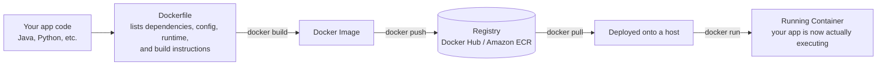
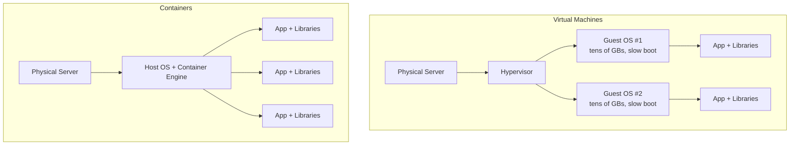

# 1. In the Beginning – Docker Container
*Section 1: Kubernetes Basics · ~9 min*

> Notes below are built from the lecture transcript (translated from Thai into English and cleaned up).

## The million-dollar question: what is a Docker container?

The lecture opens with a story to build intuition before giving the formal definition.

## The story: one developer, three environments

You're a happy developer, writing code for your project in your **development environment**. That environment's runtime is **Python 3.8**. You're importing a couple of dependencies — say, an HTTP library like `requests` and a web framework like `Flask` — plus a config file with connection settings (host names, ports, etc.). Everything works great in dev.

Then you move your code to the **staging/test environment**. Here the runtime is **Python 3.6**. One of your dependencies still works fine — but another one breaks, and your config file's format doesn't match either. You patch the code a bit, get it working, and think "okay, fine."

Then one day your code moves into the **production environment**, which (as production environments often are) is running an older stack — **Python 2.7**. Now *both* of your dependencies break, your config file breaks too, and your code crashes and burns in production.

At this point you're asking yourself: "why did I even take this job?"

## Two kinds of developers

There are two ways developers tend to react here (no judgment either way):

- **"It worked in dev — production is not my problem, that's an ops issue."**
- **"Hold on — it works on my machine, in my dev environment... what if I could package exactly what my code needs to run, in *any* environment, and ship that whole package to production?"**

One developer who thought the second way was **Solomon Hykes**. That thinking is exactly what became **Docker**, released in **2013**.

## So what is a container?

> A container is a lightweight, self-contained software package that includes everything needed to run an application: **code, runtime, libraries, dependencies**, and configuration.

### Image vs. container — a common point of confusion

- When you package your code, dependencies, configuration, and runtime engine together, you produce a **Docker image** (also called a *container image*).
- At this point, your application **is not running yet** — you just have an image sitting there.
- When you **run** that image, it creates a **container**.

In short: **image = the packaged template (like a class); container = a running instance of that template (like an object).**

## The full flow

1. You start with your **application code**.
2. You write a **Dockerfile** — it declares what dependencies, configuration, and runtime your app needs, plus the commands to build the image.
3. Building the Dockerfile produces a **Docker image**.
4. You store that image in a **registry** — the container equivalent of storing a `.jar` file in a Maven/Artifactory repository. Popular registries: **Docker Hub** and **Amazon Elastic Container Registry (ECR)**.
5. The image gets **deployed and run** on some platform that supports Docker — this is the moment your app actually starts executing, **inside a container**.

You can run that container on *any* platform that supports Docker. The most popular platform for running containers at scale is **Kubernetes** — and Kubernetes itself comes in different flavors: **Amazon EKS**, **Google GKE**, or since Kubernetes is open-source, you can install "vanilla" Kubernetes yourself and run your workloads on-prem, on any cluster you like.

## Containers vs. Virtual Machines

This comes up constantly in interviews, so it's worth being precise. Containers and VMs both isolate resources, but they do it very differently.

- A **virtual machine** is an abstraction of physical hardware — it turns one server into many. A **hypervisor** allows multiple VMs to run on one machine. Each VM bundles its app, libraries, and runtime — **plus a full guest operating system**, which takes up tens of gigabytes and boots slowly.
- A **container** is an abstraction at the **application layer** — it packages code and dependencies together, but **multiple containers on the same machine share the host's kernel/OS**. You don't bundle a guest OS into every container, so containers use far less space than VMs.

That's why, for the same underlying server size, you can fit noticeably **more containers than VMs**.

## Advantages of Docker containers

1. **Platform independence** — since everything the code needs is packaged with it, it doesn't depend on the host's installed runtime. Build once, run anywhere. Going back to our developer's story: instead of deploying code into different environments with different runtime engines, he's smarter now — he packages his code, the Python 3.8 runtime, his dependencies, and everything else needed into a Docker image. That image runs identically in dev, test, and production. His life is great again.
2. **Better resource utilization** — since containers don't need a separate OS, they use far fewer resources than VMs, so you can run many more containers than VMs on a single server. Higher hardware utilization means you need less hardware overall, which reduces cost.
3. **Application isolation** — containers on the same server are isolated from each other. If one application crashes, the others keep running unaffected. This isolation also reduces security risk: if one container is compromised/hacked, the impact doesn't spread to the other running containers.
4. **Lightweight and fast to scale** — containers are first created, replicated, or destroyed quickly because they're lightweight and don't require booting an OS — so applications can scale up very fast.
5. **Orchestration is a solved problem** — there are excellent container orchestrators available today that handle the heavy lifting of running containers at scale, letting you focus on your actual business logic instead.

That last point leads directly into the next question:

**What is a Container Orchestrator?**

## Key takeaways
- Containers exist to solve the "works on my machine but not in test/prod" problem, caused by mismatched runtimes/dependencies/config across environments.
- **Docker** (2013) packages code + runtime + dependencies + config into a single portable unit.
- An **image** is the built package (not yet running); a **container** is a running instance of that image.
- Containers share the host OS kernel — unlike VMs, which each need their own guest OS — making containers far lighter and faster to start.
- Key advantages: platform independence, better resource utilization, isolation, fast scaling, and access to mature orchestration tooling.

**Next:** [2. What is Container Orchestrator →](02-what-is-container-orchestrator.md)
