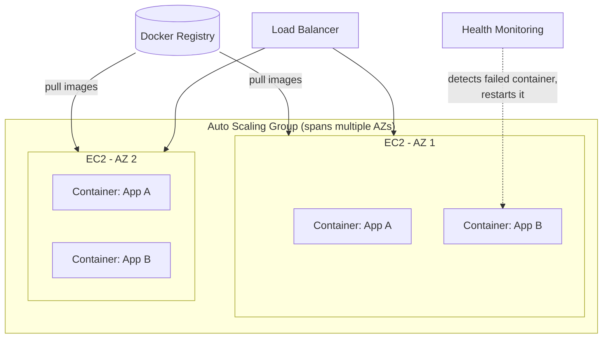

# 2. What is Container Orchestrator?
*Section 1: Kubernetes Basics · ~4 min*

> Notes below are built from the lecture transcript.

## Setting up the scenario

We already know what a Docker container is, and how it avoids "it works on my machine" scenarios. Now: what is a **container orchestrator**? It's one of those big, fancy words — like "framework" or "blockchain" — that everyone nods along to but few can actually define. Let's fix that with a concrete walkthrough.

## Walking through it: from image to a real, running system

You've built Docker images for two applications, **Application A** and **Application B**. Right now they're just sitting in a **Docker Registry** — not running, just images in a repository.

To actually run them, you need a **host**. One example of a host: an **EC2** instance. The next step is to pull those Docker images onto the EC2 instance and run them **as containers**. Now your applications are running, as containers, on EC2.

### EC2s are like wolves — you never see just one

If you're only running a single EC2 in a single Availability Zone, and it goes down, your application isn't highly available. To make it durable, you spin up **another EC2 in another Availability Zone** — now you have two EC2s running your applications.

Then traffic to your application increases. So now that EC2 needs to sit in an **Auto Scaling Group**, so it can scale out as traffic grows. Now you have a whole pack of EC2s running.

Next problem: what if **Application B** goes down on one of those EC2s? Something needs to **detect** that a container went down and **bring it back up**.

And since you now have multiple EC2s, each running multiple containers, you need something to **route traffic appropriately** across all of them — that's where a **load balancer** comes in.

## All the tasks piling up

Once you lay it all out, here's everything that needs to be handled just to keep this running reliably:

- **Deployment** of containers
- **Redundancy and availability** of containers (multi-AZ)
- **Scaling** containers up or down with demand
- **Load balancing** traffic across containers
- **Health monitoring** of both containers and hosts
- **Service discovery** — and more

Writing custom code and processes to handle *all* of this yourself is a massive undertaking — you'd basically need to be a distributed-systems expert dedicating serious time to infrastructure rather than your actual application. If that's not you, this is exactly the job a **container orchestrator** does: it takes care of all these tasks — deployment, availability, scaling, load balancing, health monitoring, service discovery — so you don't have to build it yourself.

## The container orchestrator landscape

There's more than one container orchestrator on the market:

- **Docker Swarm**
- **Apache Mesos**
- **Cattle**
- **Nomad**
- **AWS Elastic Container Service (ECS)**
- **Kubernetes** — the most popular one
- **Amazon EKS** — Elastic *Kubernetes* Service (managed Kubernetes on AWS)
- **AWS Fargate** — serverless compute for running containers, without managing the underlying EC2 hosts yourself

## Key takeaways
- An orchestrator exists because keeping containers running reliably at scale — deployment, redundancy, scaling, load balancing, health checks, service discovery — is too much to hand-build yourself.
- The path from image to running app: **Registry → pull onto a host (e.g. EC2) → run as a container**, then layer on Auto Scaling + a load balancer + health monitoring to make it production-grade.
- Multiple orchestrators exist, but **Kubernetes** is the most popular — with **Amazon EKS** and **AWS Fargate** as AWS's managed ways to run it, which this course builds toward.

**Previous:** [← 1. In the Beginning – Docker Container](01-in-the-beginning-docker-container.md)
**Next:** [3. Kubernetes Introduction →](03-kubernetes-introduction.md)
