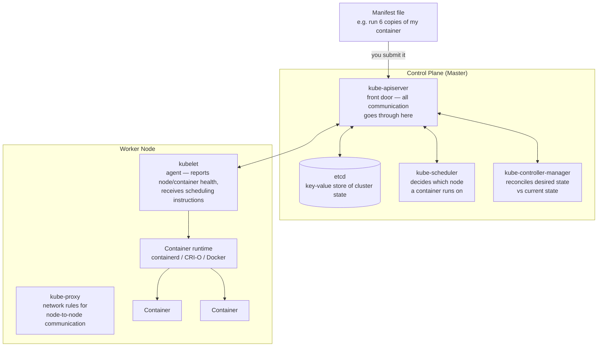

# 3. Kubernetes Introduction
*Section 1: Kubernetes Basics · ~9 min*

## Why Kubernetes exists

Kubernetes is the most popular container orchestrator — but what actually *is* it, what are its components, and what does each one do? Start with the reason it exists at all: **to run your application.**

You package your code, configuration, dependencies, and runtime engine into a **Docker (container) image**. When you run that image, it creates a **container**. So — where does that container actually run?

## Nodes: where your containers live

A **Kubernetes Node** hosts your containers. Think of a node as a physical or virtual server — for example, an **Amazon EC2 instance** can act as a node. When you run Kubernetes on AWS, you typically have one or more nodes, each running containers for one or more applications. So your containers run on these **worker nodes**.

But *something* needs to manage this: which containers go to which node, how many copies of a container should run, whether the cluster needs more nodes, etc. That's the job of the **Kubernetes Master**, also called the **Control Plane**.

## The Control Plane's four components

1. **etcd** — as containers get loaded into nodes, something needs to track which container is on which node, when it was loaded, and so on. `etcd` is a **consistent, highly-available key-value store** that saves all this critical cluster information.

2. **kube-scheduler** — schedules your container onto the *right* node. It factors in things like the container's resource requirements, policy constraints, data locality, and inter-workload interference when deciding placement.

3. **kube-controller-manager** — ensures the cluster stays in its proper **state**. This is where the **desired state vs. current state** concept comes in (a common interview topic):
   - Kubernetes cluster state is just a specific configuration you've asked for. Say your cluster is supposed to run 3 nodes — that's the **desired state**.
   - If one node goes down, the **current state** becomes 2 nodes. Desired state ≠ current state.
   - `kube-controller-manager` observes this mismatch and brings up another node, until current state matches desired state again.

   You specify the desired state yourself, via a **manifest file** — e.g., "run 6 copies of my container image." You submit that to the Kubernetes master. `kube-controller-manager` observes: desired state = 6 containers, current state = 0. It works together with `kube-scheduler` to schedule 6 containers onto nodes, making current state equal desired state.

4. **kube-apiserver** — `kube-scheduler` and `kube-controller-manager` aren't exposed outside the cluster, so you don't talk to them directly. Instead, you communicate through the **API server** — the **front end of the control plane**, which exposes the Kubernetes API. Any time you specify a new state or change an existing one, you interact with `kube-apiserver`, and the other control-plane components spring into action behind the scenes to reconcile desired state with current state.

## The Node's components

To actually run your container, a node needs a **container runtime** — the software responsible for running containers. Kubernetes supports several: **containerd**, **CRI-O**, and of course the most popular, **Docker**.

But the master needs to *communicate* with the node — telling it "run a container here" — and the node needs to report back whether things are healthy. That communication is handled by two more components:

- **kubelet** — an agent that runs on **every node** in the cluster. It makes sure containers are running okay and reports back to the master if something goes wrong. When the master wants to schedule a container onto a node, it communicates that through the kubelet.
- **kube-proxy** — a network proxy that runs on **every node**, maintaining network rules. These rules allow network communication to your containers, both from inside and from outside the cluster — this is what enables, say, a database container on one node and an application server container on another node to talk to each other.

## Putting it all together

Kubernetes has two main parts:

- **Control Plane (Master)** — `etcd`, `kube-scheduler`, `kube-controller-manager`, `kube-apiserver`.
- **Worker Nodes (Data Plane)** — `kubelet`, container runtime, `kube-proxy`.

This is a 30,000-ft overview — later lectures go deeper into each of these components.

## A quick naming note

You'll often hear Kubernetes referred to as **"K8s."** That's because there are exactly **eight letters between the K and the S** in "Kubernetes" — hence the affectionate shorthand.

## Key takeaways
- Kubernetes exists to run your application's containers reliably — everything else is in service of that.
- **Nodes** run your containers; the **control plane** decides what runs where and keeps the cluster in the state you asked for.
- Control plane = **etcd** (state store) + **kube-scheduler** (placement decisions) + **kube-controller-manager** (reconciles desired vs. current state) + **kube-apiserver** (the only front door — everything goes through it).
- Node = **container runtime** (runs containers) + **kubelet** (agent/health reporting, receives scheduling instructions) + **kube-proxy** (networking/node-to-node communication).
- You declare **desired state** via a **manifest file**; Kubernetes continuously reconciles **current state** to match it.
- "K8s" = K + 8 letters + s.

**Previous:** [← 2. What is Container Orchestrator](02-what-is-container-orchestrator.md)
**Next:** [4. Pods →](04-pods.md)
