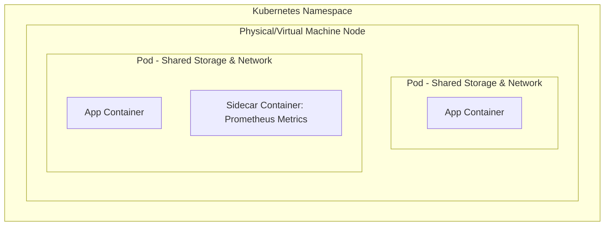

# Kubernetes Pods: The Fundamental K8s Object

## Overview

A Kubernetes Pod is one or more containers that share storage and network resources. It is the object that hosts a container and all its related resources, performing an interrelated function as part of the same workload.

## Why This Matters

You cannot deploy a container directly to a Kubernetes cluster. You must wrap it in a Pod, which acts as the deployment unit. In addition to defining the containers themselves, each Pod also defines the specific storage and networking configurations required for that workload.

## Key Concepts

* **The Deployment Flow:** App Code $\rightarrow$ Docker Image $\rightarrow$ Registry $\rightarrow$ K8s Pod $\rightarrow$ K8s Node.
* **The NPC Hierarchy:** **N**ode contains **P**ods; **P**ods contain **C**ontainers. Every Pod runs on the same physical or virtual machine within your cluster.
* **Shared Resources:** Containers within a single Pod share network resources (like IP addresses) and storage.
* **Namespaces:** One application is often made of several Pods grouped together in a separated K8s Namespace.

## Detailed Notes

**The One-Container Best Practice**
Although you could add all the containers for your application into the same Pod, it is an industry best practice to have exactly one application container per Pod.

**The Sidecar Exception**
The option to have more than one container per Pod is meant specifically for auxiliary containers that act as sidecars. For example, you might run a secondary container that extracts metrics from the main container and exposes those metrics to a Prometheus server.

**YAML Configurations**
Pod configurations—including their shared storage and networking setups—are defined using YAML files.

**How to Scale Properly**
Never scale an application by adding more primary app containers to a single Pod. Scale by spinning up **additional Pods** within the Node.

## Workflow


## Architecture Diagram


- https://community.veeam.com/kubernetes-korner-90/components-and-processes-for-creating-a-kubernetes-pod-6335 



## Step-by-Step Process

1. Containerize your application.
2. Push the image to a registry.
3. Define your Pod's storage and networking configurations in a YAML file.
4. Deploy the Pod into a specific Kubernetes Namespace.
5. Kubernetes assigns the Pod to a physical or virtual machine (Node).

## Commands and Examples

*Manifest YAML creation is covered in the next lecture. To check basic status:*

```bash
kubectl get pods -n <namespace-name>

```

## Best Practices

* **One container per Pod:** Group all the Pods that conform to one application into a Namespace.
* **Use Sidecars for Auxiliary Tasks:** Limit multi-container Pods to helper tasks like logging or metric extraction (e.g., Prometheus).
* **Keep containers stateless:** This ensures Pods can be destroyed and replaced seamlessly.

## Common Mistakes

* **Deploying directly:** Forgetting the Pod wrapper and trying to deploy bare containers.
* **Packing too many containers:** Putting all application containers into a single Pod instead of separating them and grouping them via Namespaces.

## Pro Tips

* Remember **NPC** (Node $\rightarrow$ Pod $\rightarrow$ Container) to instantly visualize K8s architecture.

## Real-World Use Cases

| Scenario | Setup |
| --- | --- |
| **Standard Web App** | One Pod running an Nginx container, grouped in a specific Namespace. |
| **Monitored App** | One Pod containing the main app container and an auxiliary sidecar container extracting metrics for Prometheus. |

## Glossary

* **Pod:** One or more containers that share storage and network resources.
* **Node:** The physical or virtual machine hosting the Pods.
* **Sidecar:** An auxiliary container running alongside the main app container.
* **Namespace:** A logical grouping used to organize multiple Pods that make up a single application.

## Revision Notes

* **Pod Definition:** A set of containers performing an interrelated function.
* **Configuration:** Defined via YAML files.
* **Shared resources:** Containers in the same Pod share storage and network resources.

## Interview Questions

**Q: What is a Kubernetes Pod?**
A: A Pod is one or more containers that share storage and network resources, operating as part of the same workload.

**Q: Should you put all your application containers into a single Pod?**
A: No, it is best practice to have one container per Pod, and then group all the Pods that make up the application into a Namespace.

**Q: When should you use multiple containers in a single Pod?**
A: When you need auxiliary containers (sidecars) to support the main container, such as extracting metrics for a Prometheus server.
