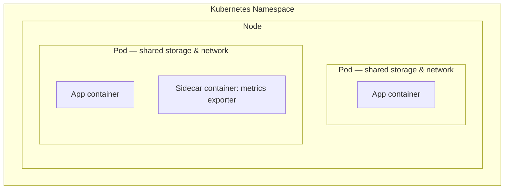

# 4. Pods
*Section 1: Kubernetes Basics · ~6 min*

## Why Pods exist

You already know the flow: app code → Docker image → registry → run it somewhere. That "somewhere" is a Kubernetes **Node**. But here's the catch — **you can never deploy a container directly to a Kubernetes cluster.** Kubernetes doesn't know what a "container" is on its own; it only understands its own object types. The smallest object Kubernetes lets you deploy is a **Pod**.

So every container you ever run on Kubernetes has to be wrapped in a Pod first.

## What is a Pod?

> A **Pod** is one or more containers that share the same storage and network resources, grouped together because they perform a related function as part of the same workload.

Think of a Pod as a thin wrapper around your container(s), which also defines the storage and networking that wrapper needs.

**The hierarchy to remember — NPC:**

**N**ode → contains → **P**ods → contain → **C**ontainers

Every Pod runs entirely on one Node — it never spans multiple machines. A Node can (and usually does) host many Pods.




## One container per Pod — the standard practice

Technically you *could* cram all your application's containers into a single Pod. In practice, industry best practice is **one application container per Pod.**

The exception is a **sidecar** — a small, auxiliary container that supports the main one instead of running the actual application logic. A classic example: a sidecar container that scrapes metrics from your main container and exposes them to Prometheus.

**How you scale, then:** never scale by adding more copies of your main container into the same Pod. Instead, you scale by creating **more Pods**. (The next lecture — ReplicaSets and Deployments — is exactly how Kubernetes automates that.)

## Namespaces: grouping related Pods

One real application is rarely a single Pod — it's usually a group of them. That group typically lives together inside a **Namespace**, a logical bucket used to separate one application (or team, or environment) from another inside the same cluster.

## How it comes together

1. Containerize your application (build the Docker image).
2. Push the image to a registry.
3. Define the Pod's containers, storage, and networking in a **YAML manifest** (the syntax for writing that YAML is covered in the next lecture).
4. Deploy the Pod into a specific Namespace.
5. Kubernetes schedules the Pod onto a Node.

```bash
# Check what Pods are running in a given namespace
kubectl get pods -n <namespace-name>
```

## Key takeaways
- You can never deploy a bare container to Kubernetes — everything is wrapped in a **Pod**.
- Remember the chain with **NPC**: Node → Pod → Container.
- Best practice: **one app container per Pod**; extra containers in the same Pod should only be **sidecars** (e.g., a metrics exporter).
- Scale by adding **more Pods**, never by stuffing more app containers into one Pod.
- Related Pods for one application are grouped into a **Namespace**.

## FAQ

**Q: Why can't I just run a container directly on Kubernetes?**
A: Kubernetes' scheduler and API only operate on Kubernetes objects, and the smallest deployable object is a Pod — not a raw container. The Pod is what carries the networking/storage config a container needs to run inside the cluster.

**Q: When should a Pod have more than one container?**
A: Only for tightly-coupled helper containers (sidecars) that support the main container's job — e.g., log shippers, metrics exporters, proxies. If two containers don't need to share network/storage and live/die together, they belong in separate Pods.

**Q: If I need 5 copies of my app running, do I edit the Pod to add 5 containers?**
A: No — that would break the one-container-per-Pod rule and doesn't give you real redundancy (all 5 would live/die together on one Node). Instead you create 5 separate Pods, which is exactly what a **ReplicaSet** automates.

**Previous:** [← 3. Kubernetes Introduction](03-kubernetes-introduction.md)
**Next:** [5. ReplicaSet & Deployment →](05-replicaset-and-deployment.md)
