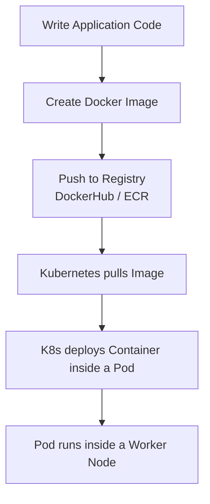
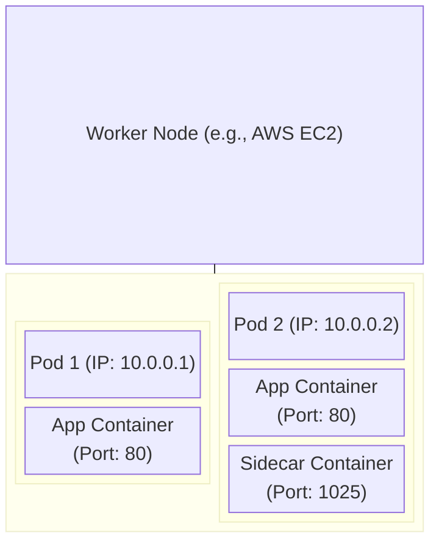

# Chapter Title: Kubernetes Pods - The Fundamental Building Blocks

## Overview

This chapter introduces **Kubernetes Pods**, the most basic and fundamental unit of deployment in Kubernetes. Often described as the "atom" of Kubernetes or the "arc reactor" that powers Iron Man, Pods are the essential wrappers that hold your running containers. You will learn how Pods fit into the broader Kubernetes ecosystem, the structural hierarchy of K8s, and the core rules for scaling and networking within a Pod.

## Why This Matters

In a modern cloud-native environment, you **cannot deploy containers directly to a Kubernetes cluster**. Understanding Pods is crucial because they are the interface through which Kubernetes manages, scales, and networks your applications. Grasping how Pods interact with Nodes and containers forms the foundation for everything else you will build in Kubernetes.

## Key Concepts

* **The Deployment Pipeline:** The journey from source code to a running Kubernetes Pod.
* **The Pod:** The smallest deployable computing unit in Kubernetes.
* **The NPC Hierarchy:** A simple mnemonic (Node $\rightarrow$ Pod $\rightarrow$ Container) to remember the structural layers of a cluster.
* **Pod Networking:** How Pods use IP addresses and how containers inside them use network ports.
* **The Sidecar Pattern:** Running helper containers alongside your main application in the same Pod.
* **Scaling Rules:** The correct K8s methodology for scaling applications horizontally.

## Detailed Notes

### The Deployment Pipeline

Before a Pod can exist, your application must go through a packaging phase.

1. **Develop:** Write your application code.
2. **Dockerize:** Package your app and its dependencies into a Docker image.
3. **Store:** Push that image to a container registry (like Docker Hub or AWS Elastic Container Registry - ECR).
4. **Deploy:** Kubernetes pulls this image from the registry and runs it as a container **inside a Pod**.

### What is a Pod?

A Pod is a Kubernetes object that encapsulates one or more containers. Think of it as a logical host for your containers. Kubernetes manages Pods, not individual containers.

### The NPC Hierarchy

To avoid confusion about what runs inside what, use the **NPC** (Non-Playable Character) mnemonic:

* **N**ode: The physical or virtual machine (e.g., an AWS EC2 instance). This is the highest level of the worker environment.
* **P**od: Runs inside the Node.
* **C**ontainer: Runs inside the Pod.

### Pod Networking and Port Conflicts

Every Pod is assigned a **unique IP address** within the cluster. Other Pods can communicate with it using this IP.
Because all containers within a single Pod share this same IP address, they also share the same network space. If you have two containers in one Pod, they cannot both listen on the same port (e.g., Port 80). One would need to use Port 80, and the other might use Port 1025.

### The Sidecar Pattern (Multi-Container Pods)

While a Pod *can* hold multiple containers, industry best practice dictates that you should generally run **only one application container per Pod**.
When do you run multiple? When you need a **Helper (Sidecar) Container**. A sidecar performs secondary tasks for the main app, such as:

* Traffic monitoring
* Log forwarding
* Circuit breaking

### How to Scale in Kubernetes

When web traffic increases and your application is overwhelmed, **do not** add a second identical application container to your existing Pod. Because they share an IP, they would fight over the same network port, causing a conflict.
**The correct way to scale:** Spin up a new Pod with its own IP address. If the Node runs out of resources, Kubernetes will spin up a new Node to host the additional Pods.

## Workflow



## Architecture Diagram



## Step-by-Step Process

**How traffic reaches a multi-container Pod:**

1. A request is sent to the Kubernetes cluster.
2. The cluster routes the request to the specific **Node** hosting the workload.
3. The Node routes the request to the target **Pod** using the Pod's unique IP address.
4. The Pod routes the request to the **Application Container** via its exposed port (e.g., Port 80).
5. Meanwhile, a **Sidecar Container** running on a separate port (e.g., Port 1025) quietly monitors the traffic or processes logs.

## Commands and Examples

*(Note: While the lecture defers the manifest file to the next video, here are the industry-standard commands used to interact with Pods.)*

**View running Pods:**

```bash
kubectl get pods

```

**View detailed information about a specific Pod (including its IP and Node):**

```bash
kubectl describe pod <pod-name>

```

**Imperatively run a simple Nginx pod:**

```bash
kubectl run my-nginx-pod --image=nginx

```

## Best Practices

* **One App Per Pod:** Keep your architecture decoupled. Only group containers in the same Pod if they must absolutely share local storage or network space (the sidecar pattern).
* **Scale via Pods:** Always scale horizontally by adding more Pods, never by packing multiple identical app containers into a single Pod.
* **Keep Images Small:** Use lightweight Docker images for your containers so Pods can start and scale up rapidly.

## Common Mistakes

* **Deploying containers directly:** Forgetting that Kubernetes strictly requires Pods as the deployment wrapper.
* **Port Conflicts:** Trying to run two Nginx containers in the same Pod, causing them to crash because both demand Port 80.
* **Treating Pod IPs as Static:** Relying on a Pod's IP address in your application code. (Pod IPs change when Pods are recreated; use K8s Services instead).

## Pro Tips

* **NPC Mnemonic:** Always visualize K8s architecture from the outside in: **N**ode contains **P**ods, **P**ods contain **C**ontainers.
* **Ephemeral Nature:** Pods are mortal. They die, they get replaced, and their IP addresses change. Design your applications to be stateless so they can survive Pod death gracefully.

## Real-World Use Cases

| Architecture | Description |
| --- | --- |
| **Simple Web Server** | A single Pod running an Nginx container serving a static website. |
| **Multi-Tier App** | One Pod running the web front-end (Nginx) communicating with a separate Pod running a database cache (Redis). They may exist on the same or different Nodes. |
| **Logging Sidecar** | A Pod containing a Java application container (doing the heavy lifting) and a Fluentd sidecar container (collecting the Java app's logs and sending them to a central server). |

## Key Takeaways

* Pods are the smallest, atomic unit of K8s scheduling.
* Containers live inside Pods; Pods live inside Nodes.
* Containers in the same Pod share an IP address and network ports.
* Scale horizontally by adding Pods, not by stuffing Pods with multiple identical containers.

## Glossary

* **Node:** A physical or virtual server (like an AWS EC2 instance) that acts as a worker machine in K8s.
* **Pod:** The smallest deployable unit in Kubernetes, acting as a wrapper for one or more containers.
* **Container:** A lightweight, standalone, executable package of software (e.g., a Docker container).
* **Sidecar Container:** A secondary container placed in a Pod to assist the main application container.
* **ECR (Elastic Container Registry):** AWS's managed container image registry service.

## Revision Notes

**Cheat Sheet:**

* **Cannot deploy directly?** Containers.
* **Smallest K8s unit?** Pod.
* **Mnemonic for K8s structure?** NPC (Node $\rightarrow$ Pod $\rightarrow$ Container).
* **Same IP space?** All containers inside a single Pod.
* **How to scale?** +1 Pod (Not +1 Container in an existing Pod).

## Interview Questions

**Q: What is a Pod in Kubernetes?**
*A: A Pod is the smallest deployable compute unit in Kubernetes. It is a logical wrapper that encapsulates one or more containers, sharing storage and network resources.*

**Q: Can you deploy a Docker container directly into a Kubernetes cluster?**
*A: No. Kubernetes does not manage containers directly; it manages Pods. You must wrap your container inside a Pod manifest to deploy it.*

**Q: If my application experiences a spike in traffic, should I add another application container into my existing Pod?**
*A: No. Containers in the same Pod share the same network namespace and IP address, which would lead to port conflicts. To scale, you should deploy additional Pods.*

**Q: What is the Sidecar pattern?**
*A: It is a design pattern where a secondary helper container is deployed in the same Pod as the main application container to handle peripheral tasks like log forwarding, proxying, or metrics collection.*

## Practice Exercises

1. **Draw the Hierarchy:** Grab a piece of paper and draw the "NPC" structure. Include an AWS EC2 instance, two Pods, and assign hypothetical IP addresses to show how networking functions.
2. **Scenario Planning:** Imagine you have a Python web app and a background task worker. Based on this lecture, decide whether they should run in the same Pod or separate Pods. (Hint: Separate Pods, as they perform distinct application functions and can be scaled independently).
