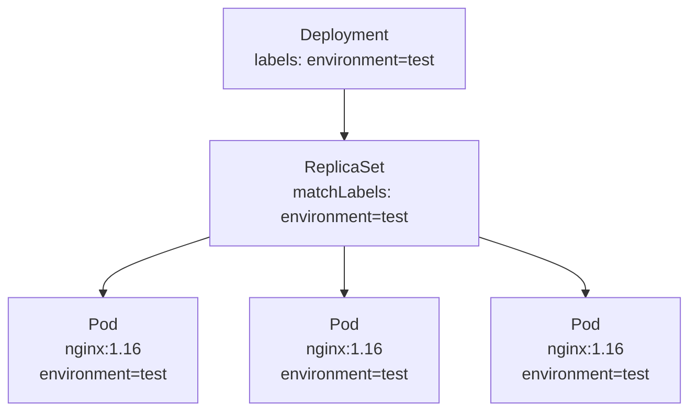
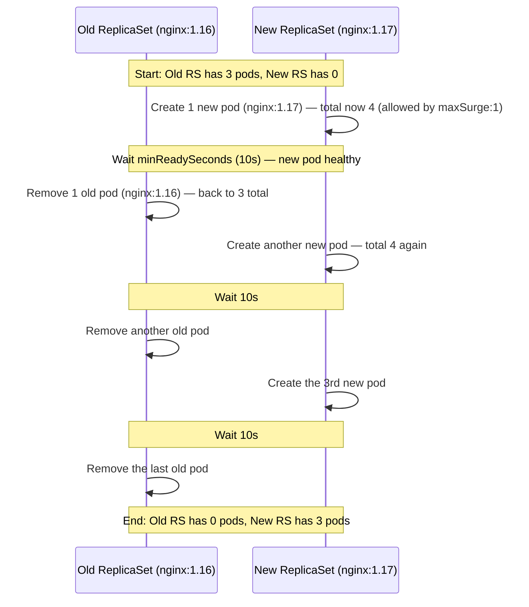

# 5. ReplicaSet & Deployment
*Section 1: Kubernetes Basics · ~11 min*

## Why Deployment matters

**Deployment** is one of the most important Kubernetes concepts — pretty much every enterprise Kubernetes implementation uses it. Here's the chain of reasoning that gets you there.

## Starting from Pods

You already know a **Pod** runs a container image. Say you want to run a web server — a Pod running **Nginx 1.16**. To make it highly available, you spin up *more* Pods running Nginx 1.16, and put them all in a **ReplicaSet**. Now if one Pod goes down, the ReplicaSet restores it, and the system stays highly available.

## But ReplicaSet can't do upgrades

What if you now want to move those Pods from **Nginx 1.16 to 1.17**? A ReplicaSet can't really help here — all it knows how to do is spin up a new Pod if one goes down, to keep the count at the desired state. It has no concept of "upgrade the image." That's exactly the gap **Deployment** fills.

## The wrapping hierarchy

Think of Deployment as another wrapper, one level up from ReplicaSet:

- A **Pod** wraps a **container**.
- A **ReplicaSet** wraps a group of **Pods**.
- A **Deployment** wraps a **ReplicaSet**.
- 


Deployment provides **declarative updates** for Pods and ReplicaSets: you describe a desired state in a deployment file, and the **Deployment controller** changes the actual state to match the desired state, at a controlled rate. You can also define deployments to create a new ReplicaSet, or to remove existing deployments and have new ones adopt their resources.



## Walking through an actual manifest

```yaml
apiVersion: apps/v1
kind: Deployment
metadata:
  labels:
    environment: test
  name: testdeploy
spec:
  replicas: 3
  selector:
    matchLabels:
      environment: test
  minReadySeconds: 10
  strategy:
    rollingUpdate:
      maxSurge: 1
      maxUnavailable: 0
    type: RollingUpdate
  template:
    metadata:
      labels:
        environment: test
    spec:
      containers:
      - image: nginx:1.16
        name: nginx
```

Read it bottom-up, starting at the Pod level:

- `template.spec.containers` says the container image is `nginx:1.16` — this is the spec used to create each **Pod**, and each Pod gets the label `environment: test` (from `template.metadata.labels`).
- `replicas: 3` is why there end up being **three copies** of the Pod.
- Setting `replicas: 3` doesn't just create 3 Pods — it also creates another Kubernetes resource: a **ReplicaSet**. That ReplicaSet's `matchLabels` is `environment: test`, meaning this ReplicaSet manages any Pod carrying the label `environment: test` — which is exactly the three Pods it just created.
- At the top level, `kind: Deployment` creates the **Deployment object**. How does the Deployment know it should manage this particular ReplicaSet (and its Pods)? Again, **labels**: the Deployment's own `metadata.labels` is `environment: test`, matching the Pod template's labels. Since they match, this Deployment manages these Pods — and the ReplicaSet it creates will carry a matching label too, which is how the Deployment manages that ReplicaSet.

**Labels are everything here** — the entire management chain (Deployment → ReplicaSet → Pods) is wired together purely through label matching.

## A subtlety: adopting pre-existing Pods

What if you create a Pod *outside* this manifest — say, with a standalone imperative `kubectl` command — giving it the label `environment: test`, and *then* apply the manifest above (which asks for 3 replicas)?

Because the label matches, the ReplicaSet and Deployment will start managing that pre-existing Pod too. Since the desired state is always "3," and one Pod already exists with the matching label, applying the manifest will only create **2 more** Pods — the 3rd is the one you created standalone. The system doesn't care how a matching Pod came to exist; it just reconciles toward the desired count.

## Self-healing, one level up each time

- **ReplicaSet restores Pods** — if a Pod becomes unavailable, the ReplicaSet immediately creates a replacement and removes the bad one, always keeping 3 Pods running.
- **Deployment restores ReplicaSet** — if you try to delete the ReplicaSet (or it goes bad), the Deployment recreates it almost instantly, with all its Pods, since the Deployment considers that ReplicaSet part of its desired state.

## Rolling updates: the `strategy` section

This is the part of the manifest we held off on:

```yaml
  minReadySeconds: 10
  strategy:
    rollingUpdate:
      maxSurge: 1
      maxUnavailable: 0
    type: RollingUpdate
```

This defines **how Pods get upgraded** — say, bumping the image from `nginx:1.16` to `nginx:1.17`.

- **`maxSurge: 1`** — how many Pods above the defined `replicas` count are allowed to exist *during* the rolling update. With `replicas: 3` and `maxSurge: 1`, up to **4** Pods can exist at once mid-rollout.
- **`minReadySeconds: 10`** — after a new Pod comes up, wait 10 seconds before taking away an old Pod (assuming the new Pod is healthy).
- **`maxUnavailable: 0`** — the maximum number of Pods allowed to be missing from the desired state during the update. With desired state = 3 and `maxUnavailable: 0`, at least **3** Pods must be running at all times throughout the rollout. (If this were `maxUnavailable: 1` instead, the rollout could drop down to `3 - 1 = 2` running Pods at a time.)

### The rollout, step by step



1. Apply the updated manifest (image bumped to `nginx:1.17`). The Deployment creates a **new ReplicaSet** to manage the new version.
2. A new Pod (`nginx:1.17`) comes up. Since `maxSurge: 1`, there are now **4** Pods total (3 old + 1 new).
3. `minReadySeconds: 10` — Kubernetes waits 10 seconds. If the new Pod is healthy, an **old** Pod (`nginx:1.16`) is removed. Back down to 3 Pods.
4. Another new Pod comes up under the new ReplicaSet → 4 Pods again. Wait 10s → another old Pod removed.
5. Repeat once more: new Pod comes up, wait 10s, last old Pod removed.
6. End state: the **new ReplicaSet** has all 3 Pods; the **old ReplicaSet** has zero.

At this point, the old (now-empty) ReplicaSet can be deleted freely — it has nothing to restore. But if you try to delete the **new** ReplicaSet (which has 3 running Pods), the Deployment will restore it, because that ReplicaSet is part of the Deployment's current desired state.

## Key takeaways
- **ReplicaSet** keeps a fixed number of identical Pods running (self-heals Pod failures) but has no concept of upgrading the image.
- **Deployment** wraps a ReplicaSet and adds **declarative, controlled-rate updates** — it can create a new ReplicaSet, shift traffic/Pods over via a rolling update, and manage the whole handoff.
- The Deployment → ReplicaSet → Pod management chain is entirely driven by **matching labels/selectors** — any Pod with a matching label gets adopted, regardless of how it was created.
- Self-healing is layered: ReplicaSet restores Pods; Deployment restores ReplicaSets.
- Rolling updates are tuned via `maxSurge` (how many extra Pods allowed above desired count), `maxUnavailable` (how many below desired count are tolerated), and `minReadySeconds` (a health/soak wait before removing an old Pod).

**Previous:** [← 4. Pods](04-pods.md)
**Next:** [6. Chicken First Or Egg First? →](06-chicken-first-or-egg-first.md)
