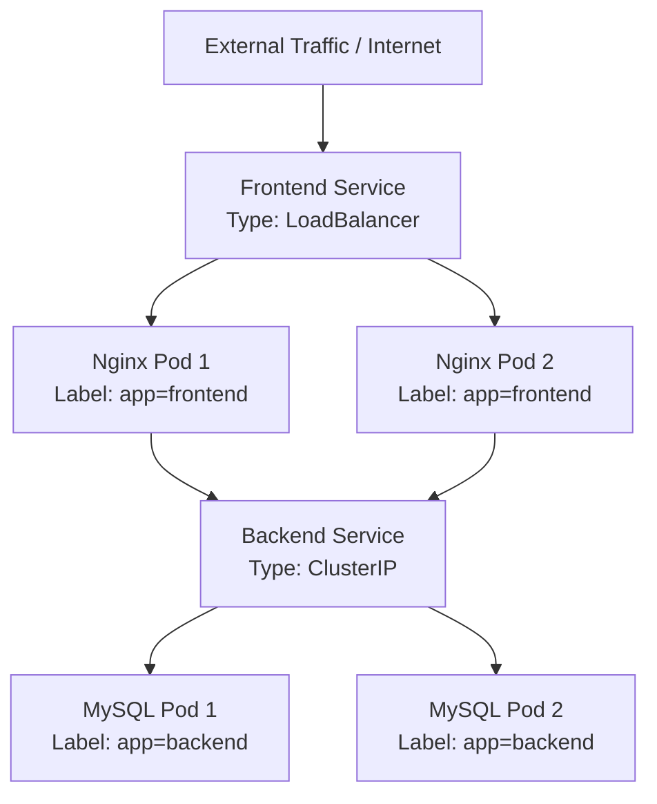
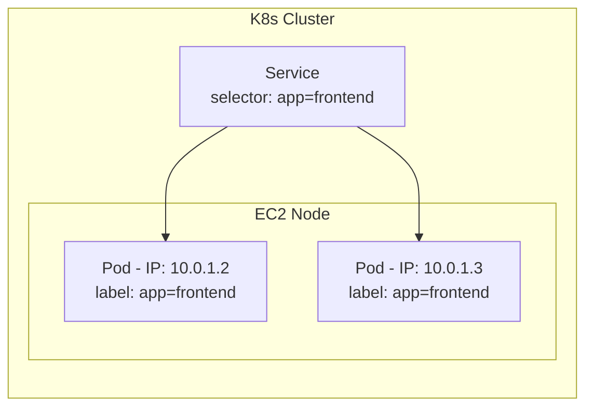

# Kubernetes Services: Networking and Discovery

## Overview

A Kubernetes Service is an abstract way to expose an application running on a set of Pods as a network service. It acts as a stable, reliable traffic router (similar to a load balancer) that sits in front of your Pods, ensuring external users or other internal Pods can always reach your application.

## Why This Matters

Pods are mortal and ephemeral. When a Pod crashes or is scaled horizontally, Kubernetes destroys it and creates a new one with a completely different IP address. If your application relies on hardcoded Pod IP addresses to communicate, the connection will break every time a Pod dies. Services solve this by providing a permanent, static IP address and DNS name that routes traffic only to healthy Pods.

## Key Concepts

* **Dynamic Pod IPs:** Pod IPs change continuously as ReplicaSets or Horizontal Pod Autoscalers create and destroy them.
* **Service Abstraction:** A Service sits in front of a group of Pods, absorbing traffic and distributing it evenly among them.
* **Label Selectors:** The mechanism a Service uses to discover which Pods it should manage and route traffic to (e.g., targeting all Pods with the label `app: frontend`).
* **LoadBalancer Type:** A specific Service type that provisions a cloud provider's native load balancer (like an AWS Elastic Load Balancer) to expose your app to the internet.

## Detailed Notes

**The Dynamic IP Problem**
Consider a cluster with a Webserver Node (`10.16.10.01`) running Nginx Pods (IPs `10.16.48.53` and `10.16.93.80`) and a Database Node (`10.18.10.21`) running MySQL Pods (IPs `10.18.32.61` and `10.18.16.23`). If the Nginx Pods connect directly to the MySQL Pods using those specific `10.18.x.x` IPs, the connection will permanently break the moment a MySQL Pod crashes and is replaced with a new IP.

**The Service Solution**
Instead of connecting Pod-to-Pod, the Nginx Pods connect to a "Backend Service". This Service maintains a static IP and automatically tracks the dynamic IPs of the underlying MySQL Pods. If a MySQL Pod dies and a new one spins up, the Service automatically discovers the new Pod and resumes routing traffic to it seamlessly.

**How Services Discover Pods (Label Selectors)**
Services do not track Pods by IP; they track them by **Labels**. When defining a Service, you provide a `selector` (e.g., `app: frontend`). The Service continuously scans the cluster for any Pods matching that exact label and adds them to its routing pool.

## Workflow



## Architecture Diagram



## Step-by-Step Process

1. Deploy your Pods (usually via a Deployment manifest) and attach a specific label to them (e.g., `app: frontend`).
2. Create a Service manifest targeting that exact label in its `selector` block.
3. Apply the Service to the cluster.
4. The Service continuously monitors the cluster for Pods matching the label.
5. External or internal traffic hits the Service, which then load-balances the requests across the matched Pods.

## Commands and Examples

**Example LoadBalancer Service Manifest:**

```yaml
apiVersion: v1
kind: Service
metadata:
  name: frontend-service
spec:
  type: LoadBalancer
  selector:
    app: frontend
  ports:
    - port: 80
      targetPort: 80

```

## Best Practices

* **Never rely on Pod IPs:** Always use a Service for communication between application tiers (e.g., Web talking to Database).
* **Consistent Labeling:** Standardize your labeling conventions (e.g., using `app`, `tier`, and `environment` labels) so Services can accurately target the correct workloads.

## Common Mistakes

* **Selector Mismatches:** Typographical errors in the Service `selector` that do not perfectly match the Pod `labels`, resulting in a Service that receives traffic but has no underlying Pods to route it to.
* **Hardcoding IPs:** Hardcoding a database Pod IP directly into a frontend application's configuration file.

## Pro Tips

* If you set a Service type to `LoadBalancer` on AWS, K8s will automatically provision a real AWS Elastic Load Balancer (ELB) in your cloud account to handle the ingress traffic.

## Real-World Use Cases

| Scenario | K8s Component Setup |
| --- | --- |
| **Public Website** | A `LoadBalancer` Service distributing internet traffic to a fleet of Nginx frontend Pods. |
| **Internal Database** | A Service distributing internal frontend traffic to a changing pool of MySQL backend Pods. |

## Key Takeaways

* Pods are mortal; their IPs change constantly.
* Services provide a stable, unchanging IP and DNS name for a group of Pods.
* Services find the correct Pods by matching Label Selectors.

## Glossary

* **Service:** A K8s abstraction that provides a stable network endpoint for a set of dynamic Pods.
* **Label Selector:** A key-value pair used by Services to identify and group specific Pods.
* **LoadBalancer:** A Service type that provisions a cloud provider's external load balancer.

## Revision Notes

* **Problem:** Pods die $\rightarrow$ IPs change $\rightarrow$ Connections break.
* **Solution:** Service acts as a static middleman.
* **Connection mechanism:** Label selectors match Service to Pods.

## Interview Questions

**Q: Why shouldn't microservices in Kubernetes communicate using Pod IP addresses?**
A: Because Pods are ephemeral. If a Pod crashes or gets rescheduled, it receives a new IP address, which would break direct IP connections. Services should be used instead to provide a stable routing endpoint.

**Q: How does a Kubernetes Service know which Pods to send traffic to?**
A: By using Label Selectors. The Service looks for any Pods in the cluster that have labels matching the Service's selector criteria.

**Q: What happens if you deploy a Service of type `LoadBalancer` in AWS?**
A: Kubernetes will communicate with the AWS API and automatically provision an Elastic Load Balancer (ELB) to distribute external internet traffic to the matched Pods.
