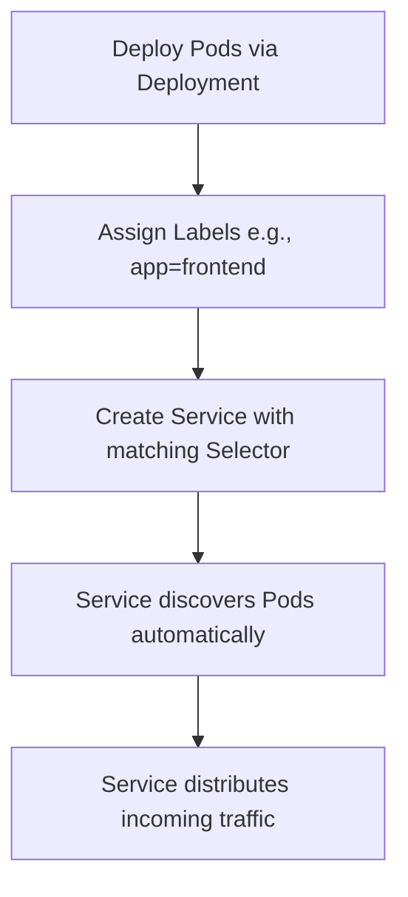
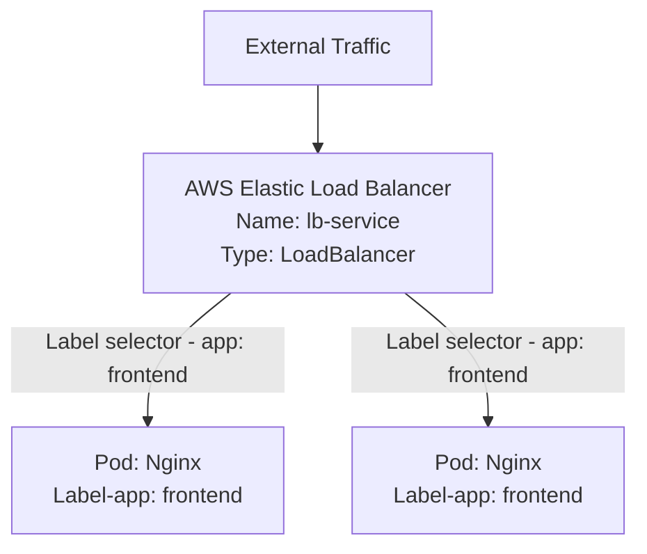

# Kubernetes Services: Networking and Discovery

## Overview

A Kubernetes Service is an abstract way to expose an application running on a set of Pods as a network service. It acts as a reliable traffic router (like a load balancer) that sits in front of your Pods, ensuring external users or other internal K8s components can always reach your application.

## Why This Matters

Pods are mortal and ephemeral. When a Pod crashes or gets replaced, it receives a completely new IP address. If your applications rely on hardcoded Pod IPs, connections will break constantly. Services solve this by providing a permanent, static IP address and DNS name that routes traffic only to healthy Pods.

## Key Concepts

* **Service Abstraction:** A stable network endpoint that absorbs traffic and distributes it across multiple backend Pods.
* **Label Selectors:** The mechanism a Service uses to discover which Pods it should route traffic to.
* **Service Types:** K8s offers distinct ways to expose services:
* **ClusterIP (Default):** Exposes the Service on an internal IP. Only reachable from *within* the cluster.
* **NodePort:** Exposes the Service on a static port across all Nodes. Reachable externally using `<NodeIP>:<NodePort>`.
* **LoadBalancer:** Provisions a cloud provider's external load balancer (e.g., AWS Elastic Load Balancer) to route internet traffic to your Service.


## Detailed Notes

**The Dynamic IP Problem**
Pods in K8s clusters dynamically scale up, down, or get recreated. If a frontend Nginx Pod connects directly to a backend MySQL Pod's IP, the connection breaks the moment that MySQL Pod crashes and gets replaced.

**How Services Discover Pods**
As shown in `image_c7c041.png`, Services do not track Pods by IP; they track them by **Labels**. When defining a Service, you provide a `selector` (e.g., `app: frontend`). The Service continuously scans the cluster for any Pods matching that exact label and adds them to its routing pool.

## Workflow



## Architecture Diagram


*The following reflects the label selector binding process shown in `image_c7c041.png`.*



## Step-by-Step Process

1. Define a Deployment that spins up Pods with a specific label (e.g., `app: frontend`).
2. Define a Service manifest with a `selector` matching that exact label.
3. Set the Service `type` (e.g., `LoadBalancer` for external AWS access).
4. Apply the manifests. K8s automatically links the Service to the Pods.
5. The cloud provider provisions the Load Balancer and begins routing traffic.

## Commands and Examples

**Deployment Manifest (`frontend-deployment.yaml`):**

```yaml
apiVersion: apps/v1
kind: Deployment
metadata:
  name: frontend-deployment
spec:
  replicas: 2
  selector:
    matchLabels:
      app: frontend
  template:
    metadata:
      labels:
        app: frontend  # <-- Label applied to Pods
    spec:
      containers:
      - name: frontend-container
        image: nginx

```

**Service Manifest (`loadbalancer-service.yaml`):**

```yaml
apiVersion: v1
kind: Service
metadata:
  name: lb-service
  labels:
    app: lb-service
spec:
  type: LoadBalancer  # <-- Provisions AWS ELB
  ports:
    - port: 80
  selector:
    app: frontend     # <-- Matches the Pod labels above

```

## Best Practices

* **Explicit Labeling:** Standardize label schemas (`app`, `tier`, `env`) so Services reliably match the correct workloads.
* **Least Privilege Exposure:** Default to `ClusterIP` for backend systems (like databases) to prevent accidental public exposure. Only use `LoadBalancer` for true frontends.

## Common Mistakes

* **Selector Mismatches:** A typo in the Service `selector` (e.g., `app: fronend`) means the Service will provision successfully but route traffic nowhere, as it cannot find matching Pods.
* **Hardcoding IPs:** Never configure an application to talk to another K8s workload using a direct IP address.

## Pro Tips

* When using a `LoadBalancer` Service on AWS, K8s directly integrates with the AWS API to create the Elastic Load Balancer. You do not need to log into the AWS console to create it manually.

## Real-World Use Cases

| Scenario | Service Type | K8s Component Setup |
| --- | --- | --- |
| **Public Website** | `LoadBalancer` | Distributes internet traffic via AWS ELB to a fleet of Nginx frontend Pods. |
| **Internal Database** | `ClusterIP` | Distributes internal frontend traffic to a changing pool of MySQL backend Pods without exposing them to the internet. |

## Key Takeaways

* Pods are mortal; Services are stable.
* Services connect to Pods using Label Selectors.
* Choose the right Service type (`ClusterIP`, `NodePort`, `LoadBalancer`) based on where traffic originates.

## Glossary

* **Service:** A stable network endpoint for a set of dynamic Pods.
* **Label Selector:** A key-value pair used by a Service to identify its target Pods.
* **ClusterIP:** The default, internal-only Service type.
* **LoadBalancer:** A Service type that provisions a public-facing cloud load balancer.

## Revision Notes

* **Problem:** Pods die $\rightarrow$ IPs change $\rightarrow$ Connections break.
* **Solution:** Services act as static routing middlemen.
* **Connection mechanism:** `selector` in Service must match `labels` in Pod template.

## Interview Questions

**Q: How does a Kubernetes Service know which Pods to send traffic to?**
A: Services use Label Selectors. They continuously scan the cluster for Pods whose labels exactly match the key-value pair defined in the Service's `selector` field.

**Q: What are the three primary types of Kubernetes Services and when do you use them?**
A: `ClusterIP` (internal routing), `NodePort` (external routing via static node ports, usually for dev), and `LoadBalancer` (external routing via cloud provider load balancers, usually for prod).

## Practice Exercises

* Review the YAML files provided above. Change the Deployment template label to `app: web`. What field in the Service YAML must you update to prevent an outage?
