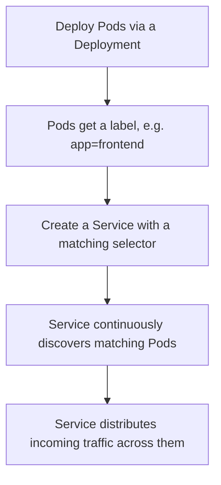
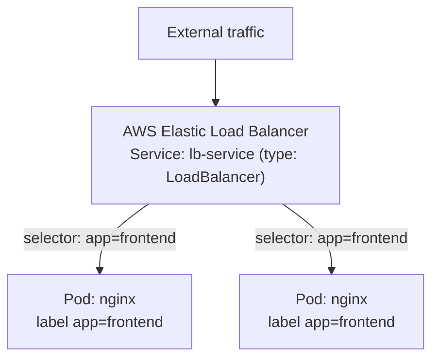

# 6. Services
*Section 1: Kubernetes Basics · ~8 min*

## The problem: Pods are mortal

Pods come and go. They scale up, scale down, crash, and get replaced constantly — and every time a Pod is recreated, **it gets a brand-new IP address.**

Imagine a frontend Nginx Pod that talks directly to a backend MySQL Pod using its IP address. The moment that MySQL Pod restarts (for any reason), its IP changes — and the frontend's connection breaks. Hardcoding Pod IPs is a dead end.

## The fix: a Service

> A **Service** is a stable network endpoint that sits in front of a group of Pods and routes traffic to whichever of them are currently healthy.

Think of it as a built-in load balancer/traffic router: it gives you one address that never changes, no matter how many times the Pods behind it are replaced.

## How a Service finds its Pods

A Service never tracks Pods by IP. Instead, it uses **label selectors** — the same mechanism that wires together Deployments, ReplicaSets, and Pods (see the [previous lecture](05-replicaset-and-deployment.md)).

You give the Service a `selector`, e.g. `app: frontend`. The Service continuously asks the Kubernetes API "which Pods currently have the label `app: frontend`?" and routes traffic to whatever it gets back — automatically picking up new Pods and dropping dead ones.




## Two scope rules worth remembering

- **Same cluster only** — a Service only looks for Pods inside its own Kubernetes cluster. It cannot route to Pods in a different cluster.
- **Same Namespace only** — a Service only looks for Pods in the same Namespace it was created in. A Service in `production` will completely ignore Pods with the exact same label sitting in `testing` or `dev`.

## A minimal example

**Deployment** (creates the Pods and labels them):

```yaml
apiVersion: apps/v1
kind: Deployment
metadata:
  name: frontend-deployment
  namespace: production
spec:
  replicas: 2
  selector:
    matchLabels:
      app: frontend
  template:
    metadata:
      labels:
        app: frontend        # <-- label applied to each Pod
    spec:
      containers:
      - name: frontend-container
        image: nginx
```

**Service** (finds those Pods and routes traffic to them):

```yaml
apiVersion: v1
kind: Service
metadata:
  name: lb-service
  namespace: production
spec:
  type: LoadBalancer
  ports:
    - port: 80
  selector:
    app: frontend           # <-- must match the Pod labels above
```

Apply both, and Kubernetes wires the Service to those Pods automatically — on AWS, `type: LoadBalancer` even provisions a real AWS Elastic Load Balancer for you, without you ever touching the AWS console.



## Key takeaways
- Pods are mortal and their IPs change; **Services are the stable address** in front of them.
- A Service finds its Pods purely through **label selectors** — a typo in the selector means the Service exists but routes traffic nowhere.
- A Service only ever sees Pods in its **own cluster and own Namespace.**
- On AWS, a `LoadBalancer`-type Service provisions a real Elastic Load Balancer automatically.
- Default to `ClusterIP` for internal-only workloads (like a database); the next lecture covers all three Service types (`ClusterIP`, `NodePort`, `LoadBalancer`) in depth.

## FAQ

**Q: How does a Service actually know which Pods to send traffic to?**
A: It watches the Kubernetes API for any Pod whose labels match its `selector` field, and keeps that list of healthy targets up to date automatically as Pods are created or destroyed.

**Q: My Service exists but nothing seems to reach my Pods — what's the most common cause?**
A: A selector mismatch — usually a typo (`app: fronend` instead of `app: frontend`). The Service is created successfully either way; it just has zero matching Pods to route to.

**Q: Can a Service in the `production` Namespace route to a Pod with the same label in `dev`?**
A: No. Services are strictly Namespace-scoped — they only ever consider Pods in the same Namespace they were created in.

**Previous:** [← 5. ReplicaSet & Deployment](05-replicaset-and-deployment.md)
**Next:** [7. Service Types →](11_ServiceTypes.md)
