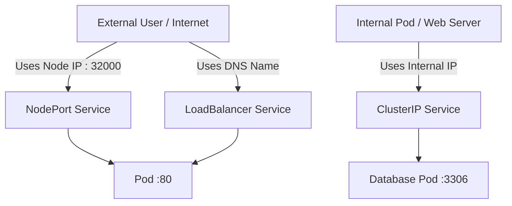
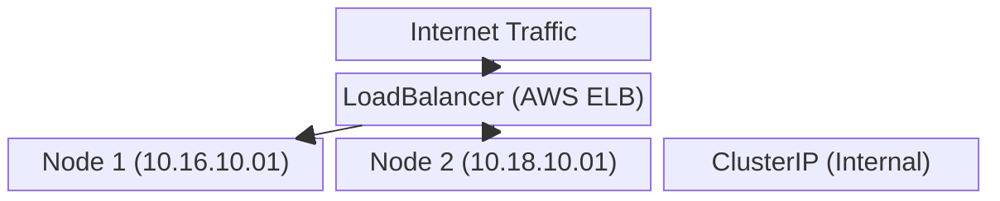

# Chapter Title: Kubernetes Service Types

## Overview

This chapter covers the three primary types of Kubernetes Services: ClusterIP, NodePort, and LoadBalancer. Regardless of the type chosen, all Services perform the fundamental job of discovering and distributing network traffic across underlying Pods using label selectors.

## Why This Matters

Different components of a cloud-native application require different levels of network exposure. A frontend web server must be accessible from the public internet, while a backend database should be strictly isolated internally. Understanding Service types allows you to securely route traffic and expose applications only where necessary.

## Key Concepts

* **ClusterIP:** The default Service type that exposes an application only within the cluster.
* **NodePort:** Exposes the Service externally by opening a specific cluster-wide port on every worker Node.
* **LoadBalancer:** A cloud-specific implementation that provisions an external load balancer (like AWS ELB) to route external traffic to your Pods.
* **Label Selectors:** The universal mechanism all Service types use to identify which Pods to manage and send traffic to.

## Detailed Notes

### ClusterIP (Default)

* If you define a Service manifest without mentioning a specific `type`, Kubernetes defaults to ClusterIP.
* It is completely inaccessible from outside the cluster.
* **Ideal Use Case:** Routing traffic from an internal web server to a backend database.
* **Ports:** The `port` field defines how other K8s components access the Service, while `targetPort` dictates which port the destination container is listening on. By default, it uses the TCP protocol.

### NodePort

* NodePort allows access from outside the cluster by assigning a port from the range `30000` to `32767`.
* You access the application using the combination of any Node's IP address and the assigned NodePort (e.g., `[https://10.16.10.01:32000](https://10.16.10.01:32000)`).
* **Traffic Flow:** External traffic hits the NodePort -> Redirects to the Service's internal port -> Forwards to the container's `targetPort`.
* **Cluster-Wide Distribution:** If you hit the IP of Node A, the traffic does not just stay on Node A. The NodePort service will distribute that traffic across all matching Pods in the entire cluster, even if they reside on Node B.
* *Note:* NodePort is rarely used for production external exposure because Node IPs can change, making it difficult to manage.

### LoadBalancer

* This is the preferred method for exposing an application to the outside world.
* It is cloud-specific; for example, deploying this on AWS provisions an Elastic Load Balancer (ELB).
* It provides enterprise features that NodePorts lack, such as a stable DNS name, SSL termination, Web Application Firewall (WAF) integration, access logs, and health checks.

## Workflow



## Architecture Diagram



## Step-by-Step Process

1. Determine the required exposure level for your Pods.
2. If it is internal only, write a Service manifest omitting the `type` field (defaults to ClusterIP).
3. If it requires external testing, set `type: NodePort` and define a `nodePort` between 30000-32767.
4. If it is a production frontend, set `type: LoadBalancer` to provision cloud-native routing.
5. Ensure your `selector` perfectly matches the `labels` on your target Pod deployment.

## Commands and Examples

**ClusterIP Manifest Example:**

```yaml
apiVersion: v1
kind: Service
metadata:
  name: backend-service
spec:
  # type is omitted, defaults to ClusterIP
  selector:
    app: app-server
  ports:
    - protocol: TCP
      port: 80
      targetPort: 80

```

**NodePort Manifest Example:**

```yaml
apiVersion: v1
kind: Service
metadata:
  name: frontend-nodeport
spec:
  type: NodePort
  selector:
    app: front-end
  ports:
    - port: 80
      targetPort: 80
      nodePort: 32000

```

## Best Practices

* **Omit Protocol for TCP:** If your application uses TCP, you can safely remove the `protocol` field from your manifest, as TCP is the default.
* **Production Exposure:** Always use `LoadBalancer` (or Ingress) to expose production apps to the outside world, avoiding `NodePort` due to changing Node IPs.

## Common Mistakes

* **Confusing Ports:** Mixing up `port` (the port the Service listens on) and `targetPort` (the port the application container is actually using).
* **Assuming Local Node Isolation:** Believing that hitting a specific Node's IP on a NodePort will only route traffic to Pods on that specific Node. NodePorts distribute traffic cluster-wide.

## Pro Tips

* Because LoadBalancers are cloud-specific, deploying a `LoadBalancer` manifest on a local K8s cluster (like Minikube) will often leave the Service in a "pending" state since there is no AWS/GCP API to provision the external hardware.

## Real-World Use Cases

| Architecture Tier | Recommended Service Type | Reason |
| --- | --- | --- |
| **Public Frontend Web App** | LoadBalancer | Provides a stable DNS name, SSL termination, and WAF integration. |
| **Internal Database** | ClusterIP | Secures the data layer by making it completely inaccessible from outside the K8s cluster. |
| **Local Development / Debugging** | NodePort | Quickly exposes an app without waiting for cloud load balancers to provision. |

## Key Takeaways

* All Services distribute traffic using label selectors.
* ClusterIP is internal and default.
* NodePort opens a port (30000-32767) on every Node for external access.
* LoadBalancer integrates with cloud providers for robust external access.

## Glossary

* **ClusterIP:** A Service that provides an internal IP accessible only from within the cluster.
* **NodePort:** A port opened across all worker nodes to allow external traffic into the cluster.
* **TargetPort:** The actual network port that a container is configured to listen on.
* **WAF:** Web Application Firewall, a security feature often integrated with cloud LoadBalancers.

## Revision Notes

* **Internal App?** Use ClusterIP.
* **External App (Prod)?** Use LoadBalancer.
* **External App (Dev)?** Use NodePort.
* **NodePort Range?** 30000 - 32767.

## Interview Questions

**Q: If you deploy a Service manifest without specifying a `type`, what happens?**
A: Kubernetes will default to creating a ClusterIP Service, which is only accessible from within the cluster.

**Q: Explain the difference between `port`, `targetPort`, and `nodePort`.**
A: `nodePort` is the external port exposed on all Nodes (30000-32767). It redirects traffic to the `port`, which is the internal port the Service itself listens on. Finally, the Service routes the traffic to the `targetPort`, which is the port the actual Pod/container is listening on.

**Q: Why shouldn't you use NodePort for a production public-facing application?**
A: You must know the specific IP address of the Node to connect via NodePort. Since Node IPs can change (if a Node crashes and is replaced), managing DNS routing is difficult and unreliable.

## Practice Exercises

* Review a standard multi-tier deployment. Draft a `ClusterIP` Service YAML for the Redis backend, and a `LoadBalancer` Service YAML for the React frontend. Ensure your `targetPort` configurations align with standard default ports (6379 and 80).
