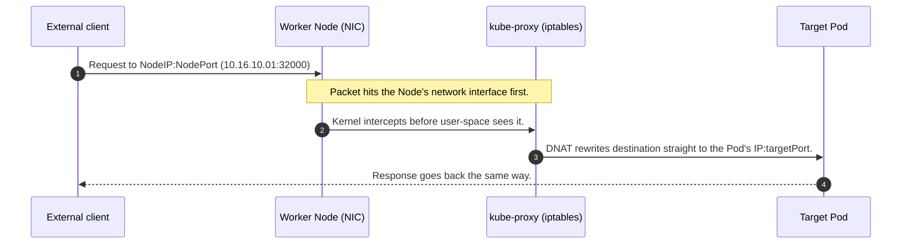
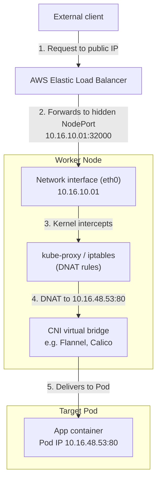

# 7. Service Types
*Section 1: Kubernetes Basics · ~10 min*

## The three flavors of Service

Every Service — regardless of type — does the same fundamental job: it finds Pods via a **label selector** and distributes traffic to them (see [the previous lecture](10_Services.md)). What changes between types is **who is allowed to reach it.**

| Type | Reachable from | Typical use |
| --- | --- | --- |
| **ClusterIP** (default) | Only inside the cluster | Internal traffic — e.g., app server → database |
| **NodePort** | Any Node's IP, on a fixed port | Quick external access for dev/testing |
| **LoadBalancer** | The public internet, via a cloud load balancer | Production-facing apps |

## ClusterIP — the default, internal-only option

If you don't specify a `type` in your Service manifest, Kubernetes defaults to `ClusterIP`. It's completely unreachable from outside the cluster — which makes it the right choice for anything that should never be exposed publicly, like a backend database.

```yaml
apiVersion: v1
kind: Service
metadata:
  name: backend-service
spec:
  # type omitted -> defaults to ClusterIP
  selector:
    app: app-server
  ports:
    - protocol: TCP    # TCP is the default, so this line is optional
      port: 80
      targetPort: 80
```

`port` is what other things *inside* the cluster use to reach the Service; `targetPort` is the port the destination container is actually listening on.


## NodePort — a fixed port on every Node

A `NodePort` Service opens the **same static port** (somewhere in the range `30000–32767`) on **every Node in the cluster** — not just the Node where a matching Pod happens to live. You reach it with `<any-Node-IP>:<NodePort>`.

```yaml
apiVersion: v1
kind: Service
metadata:
  name: frontend-nodeport
spec:
  type: NodePort
  selector:
    app: front-end
  ports:
    - port: 80
      targetPort: 80
      nodePort: 32000
```


**Worked example:** say your Service `frontend-service` (selector `app: frontend`) has matching Pods running on Node 1 (`10.16.10.01`) and Node 2 (`10.18.10.01`). A request to `10.16.10.01:32000` hits Node 1 — but the Service load-balances it across **all** matching Pods cluster-wide, including the ones sitting on Node 2. You don't need to know or care which Node actually hosts the Pod you land on.

**Why it's rarely used in production:** you're exposing raw Node IP addresses to your clients. If `10.16.10.01` crashes and gets replaced, its IP changes, and anything pointed at the old IP breaks — even though the Pods themselves are perfectly healthy on other Nodes. Managing DNS around Node IPs that can change is fragile, which is exactly the problem `LoadBalancer` (below) solves.

## LoadBalancer — the production-grade option

`LoadBalancer` is cloud-specific: on AWS, creating one provisions a real **AWS Elastic Load Balancer (ELB)** automatically — no manual work in the AWS console required. Compared to NodePort, it gives you enterprise features NodePort doesn't have out of the box: a stable DNS name, SSL termination, WAF integration, access logs, and health checks.


> **Heads up if practicing on a local cluster (e.g., Minikube):** `LoadBalancer` Services stay stuck in "pending" state there, because there's no cloud API available to actually provision the load balancer.

## Choosing between them

* **Internal only** (e.g., a database) → `ClusterIP`.
* **Quick external access while developing/debugging** → `NodePort`.
* **Production-facing app** → `LoadBalancer` (or an Ingress, covered later in the course).

## Under the hood: what actually happens to a packet

This part isn't required to *use* Services, but it comes up constantly in interviews and it demystifies a lot of Kubernetes networking.

**A Service isn't a real box a packet stops at.** It's a virtual abstraction — under the hood it's really just a set of routing rules. `kube-proxy` (an agent running on every Node) continuously writes those rules into the Linux kernel's `netfilter`/`iptables` (or IPVS), based on whatever Services and their selectors currently exist.

So when we say "traffic goes to the Service," what's really happening is:

1. An external request hits a **Node's** network interface — because a Service has no IP address reachable from outside the cluster on its own; the Node is the only real physical door in.
2. Before the OS treats it as normal traffic, the kernel's `netfilter`/`iptables` rules (written by `kube-proxy`) **intercept the packet.**
3. Those rules perform **Destination NAT (DNAT)** — rewriting the packet's destination from `<NodeIP>:<NodePort>` straight to the internal IP of one of the healthy backend Pods.
4. The packet is forwarded across the cluster's internal network (via the CNI plugin — e.g., Flannel or Calico) directly into that Pod.



**Where `LoadBalancer` fits in:** when you create a `LoadBalancer` Service, Kubernetes quietly creates a `NodePort` behind the scenes too. The cloud ELB receives the internet traffic and forwards it to that hidden NodePort on one of your worker Nodes — then the exact same `kube-proxy`/DNAT process above takes over from there.



## Key takeaways
- All three Service types find Pods the same way — via **label selectors.** Only external reachability differs.
- **ClusterIP** (default): internal only. **NodePort**: fixed port (30000–32767) on every Node. **LoadBalancer**: provisions a real cloud load balancer.
- A **NodePort request to one Node can still land on a Pod running on a different Node** — the Service load-balances cluster-wide, not per-Node.
- Avoid `NodePort` for production public traffic: it exposes Node IPs directly, which break if that Node is replaced.
- A `LoadBalancer` Service is a `NodePort` Service plus a cloud load balancer in front of it — same DNAT mechanics underneath, just with a stable entry point.
- A Service is not a physical hop — it's `iptables`/IPVS rules written by `kube-proxy`, performing DNAT to the right Pod.

## FAQ

**Q: If I hit `10.16.10.01:32000` and Node `10.16.10.01` goes down, what happens — even though my Pods are healthy elsewhere?**
A: The request fails. The Node you targeted is the only physical entry point for that specific IP; a dead Node means a dead entry point, no matter how healthy the backend Pods are on other Nodes. This is exactly why NodePort isn't used for production external access — either manually redirect clients to a surviving Node's IP, or (the real fix) put a `LoadBalancer` in front of the cluster so it automatically stops routing to dead Nodes.

**Q: Does a `kubectl` request or external client ever really "talk to a Service"?**
A: Conceptually yes (that's the useful mental model); physically no. A Service has no process, no container, and no dedicated machine — it's a label that resolves to a live set of `iptables`/IPVS rules on every Node, rewritten continuously by `kube-proxy` as matching Pods come and go.

**Q: What's the difference between `port`, `targetPort`, and `nodePort`?**
A: `nodePort` is the external port opened on every Node (30000–32767). `port` is the port the Service itself listens on internally. `targetPort` is the port the actual container inside the Pod is listening on. Traffic flows `nodePort → port → targetPort`.

**Previous:** [← 6. Services](10_Services.md)
**Next:** [8. Declarative vs. Imperative →](14_Declarative_vs._Imperative.md)
