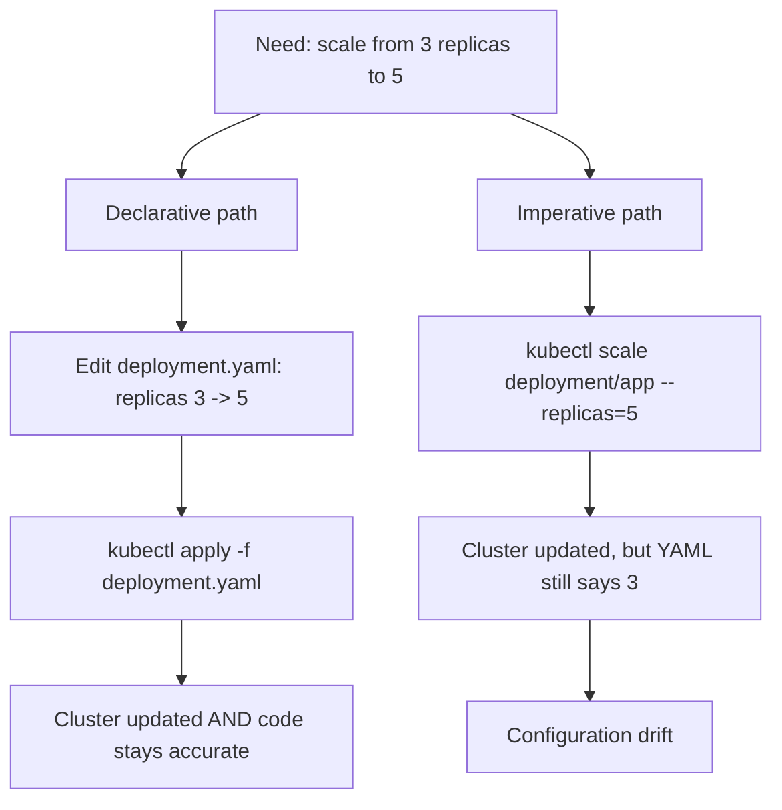

# 8. Declarative vs. Imperative
*Section 1: Kubernetes Basics · ~6 min*

## Two ways to tell Kubernetes what to do

Every change you make to a Kubernetes cluster falls into one of two styles:

- **Declarative — say *what* you want.** You write a YAML file describing the desired end state, and Kubernetes figures out how to get there.
- **Imperative — say *how* to do it, right now.** You run a direct `kubectl` command that changes the live cluster immediately.

Both styles are real and useful — the question is *when* to use which.

## Declarative: the standard for real work

You describe the state you want in a manifest file, and apply it:

```bash
kubectl apply -f nginx-deployment.yaml
```

Want to scale from 3 replicas to 5? Open the YAML, change `replicas: 3` to `replicas: 5`, and re-apply. The file is now the **single source of truth** — hand it to a teammate or redeploy it to a new environment, and you get the exact same infrastructure every time.

## Imperative: fast, but the cluster and your code disagree

Imperative commands skip the file entirely:

```bash
# Create a deployment directly from the terminal, no file involved
kubectl create deployment my-deployment --image=nginx:1.16

# Scale an existing deployment right now
kubectl scale deployment/test-deploy --replicas=5
```

These work instantly — but here's the trap: if you imperatively scale to 5 replicas, the **live cluster** says 5, while your **YAML file** still says 3. Nothing has synced them. If that YAML ever gets re-applied later — say, your CI/CD pipeline runs again, or the cluster gets rebuilt from source — it will silently scale you back down to 3. This mismatch is called **configuration drift**, and it's a real production incident waiting to happen (e.g., you scale up imperatively during a traffic spike, forget to update the YAML, and the next deploy quietly undoes your fix).

## When to actually use imperative commands

Despite the warning above, imperative commands aren't "wrong" — they're just scoped to the right moments:

- Rapid prototyping and learning in a sandbox
- Debugging or triaging a live incident, where speed matters more than perfect bookkeeping
- **Generating a YAML file for you** — the best of both worlds (see below)

## The best trick: let `kubectl` write the YAML for you

You can run an imperative command with `--dry-run=client -o yaml` to have `kubectl` print the equivalent manifest **without actually sending it to the cluster:**

```bash
kubectl create deployment my-app --image=nginx --dry-run=client -o yaml > my-app.yaml
```

This gives you a real starting YAML file in seconds, which you then commit to version control and manage declaratively from that point on.



## Fixing drift once it's happened

1. Find the live resource that was changed imperatively.
2. Export its current live config to YAML (`kubectl get ... -o yaml`, or your dry-run trick above).
3. Clean it up — strip cluster-generated fields like timestamps and internal IDs.
4. Commit the corrected YAML to your repo.
5. From here on, manage that resource declaratively.

## Key takeaways
- **Declarative** (`kubectl apply -f file.yaml`) describes the *what*; it's the production standard because it's reproducible and keeps your Git repo as the source of truth.
- **Imperative** (`kubectl create`, `kubectl scale`, `kubectl edit`, ...) describes the *how*; it's fast, but changes the live cluster without touching your YAML — causing **configuration drift**.
- Rule of thumb: if you ever change something imperatively, go update the YAML to match — or the next deploy will silently undo you.
- `--dry-run=client -o yaml` is the sanctioned shortcut: generate a manifest imperatively, then manage it declaratively forever after.

## FAQ

**Q: If imperative commands are discouraged, why do they even exist?**
A: They're ideal for prototyping, local learning, and emergency incident triage — situations where you need an immediate change and can reconcile the YAML afterward. They just shouldn't be your day-to-day way of managing production.

**Q: What's the actual risk of configuration drift, concretely?**
A: You scale a Deployment up imperatively to handle a traffic spike. Nobody updates the YAML. Days later, an unrelated CI/CD deploy re-applies that YAML — and silently scales you back down to the old, lower replica count, potentially causing an outage.

**Previous:** [← 7. Service Types](11_ServiceTypes.md)
**Next:** [Section 2 → 1. Amazon EKS Overview](../02_EKS_Basics/01_EKS_Overview.md)
