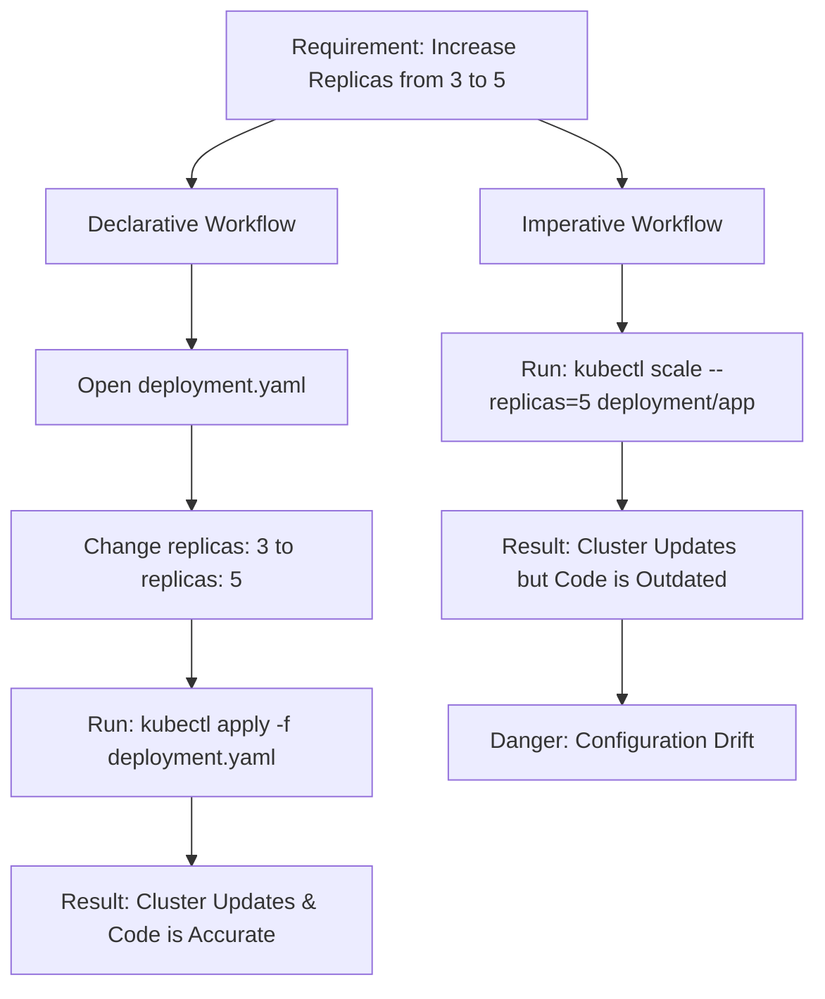
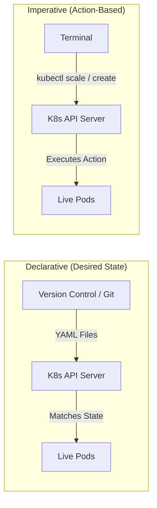

# Kubernetes Management: Declarative vs. Imperative

## Overview

Kubernetes resource management falls into two distinct categories: Declarative and Imperative. The declarative approach defines the desired final state of your infrastructure using configuration files, while the imperative approach uses direct, action-oriented CLI commands to make immediate changes to the live cluster.

## Why This Matters

Relying on imperative commands in a production environment leads to configuration drift, where the live state of your cluster no longer matches the configuration files stored in your code repository. Mastering the declarative approach is essential for reproducibility, collaboration, and implementing true Infrastructure as Code (IaC).

## Key Concepts

* **Declarative Management:** Defining the "what" (the desired end state). You supply a YAML file, and Kubernetes figures out how to make the live cluster match that file.
* **Imperative Management:** Defining the "how" (the exact steps to take). You issue direct commands instructing Kubernetes to perform a specific action right now.
* **Infrastructure as Code (IaC):** Treating your infrastructure configuration exactly like application source code—storing it in version control (like Git) so changes are tracked and reproducible.
* **Configuration Drift:** The disconnect that occurs when live infrastructure is modified manually (imperatively) without updating the underlying source code (declarative manifests).

## Detailed Notes

**The Declarative Approach (The Standard)**
Declarative management relies entirely on YAML manifest files. Your manifest serves as the ultimate source of truth and documentation for your infrastructure. If you need to scale an application from 3 replicas to 5, you open the YAML file, change the `replicas` integer to `5`, and re-apply the file.
When passed to another team member or deployed to a new environment, the file guarantees the exact same infrastructure will be provisioned every time.

**The Imperative Approach (The Quick Fix)**
Imperative management relies on individual `kubectl` commands (like `create`, `scale`, or `edit`). If you scale from 3 replicas to 5 imperatively, the live cluster updates immediately, but your YAML file still says `3`.
If you later redeploy that YAML file to a new environment—or if the cluster crashes and rebuilds from the code—it will revert to 3 replicas. The imperative change is lost permanently.

**When to Use Which**
Imperative commands are excellent for rapid prototyping, debugging, or learning in a sandbox environment. However, once an application moves toward staging or production, all modifications must transition strictly to declarative manifests.

## Workflow



## Architecture Diagram



## Step-by-Step Process

**Fixing Configuration Drift:**

1. Identify a live resource that was modified imperatively.
2. Export the live configuration back to a YAML file to capture the current state.
3. Clean up the exported YAML (removing dynamic cluster-generated fields like timestamps or unique IDs).
4. Save the corrected YAML file to your version control repository.
5. Re-apply the file declaratively to sync the code with the live cluster.

## Commands and Examples

**Declarative Command:**
*Creates or updates resources to match the exact state defined in the file.*

```bash
kubectl apply -f nginx-deployment.yaml

```

**Imperative Commands:**
*Creates a deployment directly from the terminal without a file.*

```bash
kubectl create deployment my-deployment --image=nginx:1.16

```

*Scales an existing deployment instantly, bypassing the YAML file.*

```bash
kubectl scale deployment/test-deploy --replicas=5

```

## Best Practices

* **Infrastructure as Documentation:** Treat your YAML files as the single source of truth. If a configuration isn't in the YAML, it doesn't exist.
* **GitOps:** Store all declarative manifests in a Git repository to track version history, enabling quick rollbacks if a deployment fails.
* **Consistency:** Never mix imperative state changes with declarative pipelines on the same resource.

## Common Mistakes

* **Emergency Imperative Fixes:** Scaling up a deployment imperatively during a traffic spike but forgetting to update the YAML file. The next time the CI/CD pipeline runs, it will overwrite the live cluster and downscale the application back to the original YAML configuration, causing an outage.
* **Over-relying on kubectl edit:** Using `kubectl edit` is an imperative action that alters the live state without updating your local source code.

## Pro Tips

* **The Hybrid Trick (Dry-Run):** You can use imperative commands to generate declarative YAML files instantly. Use the `--dry-run=client -o yaml` flags to output the YAML code to your screen instead of sending the command to the cluster.
```bash
kubectl create deployment my-app --image=nginx --dry-run=client -o yaml > my-app.yaml

```


## Real-World Use Cases

| Scenario | Approach | Reason |
| --- | --- | --- |
| **Production Deployments** | Declarative | Ensures absolute reproducibility and aligns with CI/CD automation pipelines. |
| **Disaster Recovery** | Declarative | Allows an entire cluster to be rebuilt instantly from a Git repository. |
| **Sandbox Experimentation** | Imperative | Provides instant feedback without the overhead of writing and managing YAML files. |
| **Incident Triage/Debugging** | Imperative | Fast scaling or temporary resource creation to diagnose a live production issue. |

## Key Takeaways

* Declarative relies on YAML manifests (`kubectl apply`); Imperative relies on terminal commands (`kubectl create`, `kubectl scale`).
* Declarative provides the "what"; Imperative dictates the "how".
* Imperative changes cause configuration drift and should be strictly avoided for long-term production management.

## Glossary

* **Declarative:** Specifying the desired state of a system and allowing the system to achieve that state automatically.
* **Imperative:** Issuing explicit commands to execute an action immediately.
* **Configuration Drift:** The phenomenon where the actual live state of a system diverges from its documented configuration files.
* **Infrastructure as Code (IaC):** The practice of managing and provisioning computing infrastructure through machine-readable definition files.

## Revision Notes

* **Declarative:** `kubectl apply -f file.yaml` (Production standard, reproducible).
* **Imperative:** `kubectl scale...` (Testing only, causes configuration drift).
* **Rule of Thumb:** If you change it in the terminal, update the YAML.

## Interview Questions

**Q: Explain the difference between declarative and imperative management in Kubernetes.**
A: Declarative management uses YAML manifest files to define the desired end state of the cluster, which Kubernetes then matches. Imperative management uses direct `kubectl` commands to execute immediate, step-by-step changes to the live cluster without updating the configuration files.

**Q: What is configuration drift, and how does imperative K8s management cause it?**
A: Configuration drift occurs when the live environment differs from the source code. If you use imperative commands (like `kubectl scale`) to modify a cluster, the live state changes, but the original YAML manifest remains outdated. If that outdated YAML is reapplied later, it will overwrite the live changes.

**Q: If imperative commands are bad for production, when should you use them?**
A: Imperative commands are highly useful for local development, rapid prototyping, generating boilerplate YAML files using `--dry-run`, and emergency incident triaging.

## Practice Exercises

1. **Generate Boilerplate:** Use an imperative command with the `--dry-run=client -o yaml` flags to generate a Deployment manifest for an `httpd` image. Redirect the output into a file named `web.yaml`.
2. **Declare it:** Use a declarative command to apply `web.yaml` to your cluster.
3. **Cause Drift:** Scale the deployment to 4 replicas imperatively. Verify the live cluster has 4 Pods, then open your `web.yaml` file to observe that it still says 1 replica, successfully simulating configuration drift.
