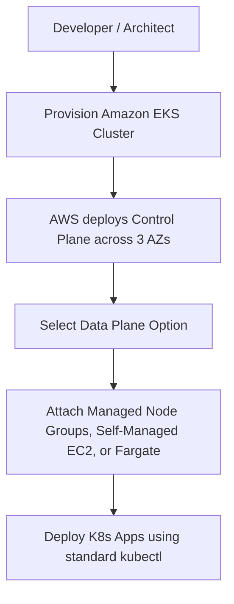

# Amazon EKS (Elastic Kubernetes Service)

## Overview

This chapter explores Amazon Elastic Kubernetes Service (EKS) and the operational differences between managing a Kubernetes cluster yourself versus using a managed cloud service. It breaks down the architecture of the Kubernetes Control Plane and Data Plane, highlighting how AWS simplifies operations by managing the complex master nodes while providing flexible options for worker node deployment.

## Why This Matters

Operating a highly available Kubernetes control plane manually requires immense operational overhead—including managing EC2 instances for master nodes, ensuring `etcd` is backed up and replicated, and executing zero-downtime version upgrades. Amazon EKS eliminates this burden by managing the control plane for you, allowing you to focus entirely on deploying applications while maintaining full compatibility with upstream, open-source Kubernetes tooling.

## Key Concepts

* **Control Plane (Master Nodes):** The brain of Kubernetes (API server, scheduler, controller manager, kube-proxy, kubelet, etcd). In EKS, AWS fully manages this layer for high availability.
* **Data Plane (Worker Nodes):** The infrastructure where your actual application pods run. In EKS, you choose how much of this you want to manage.
* **etcd:** The highly sensitive key-value store that serves as K8s's single point of truth. AWS manages and backs this up automatically in EKS.
* **Upstream Kubernetes:** EKS runs standard, open-source K8s. It is not a proprietary fork, ensuring no vendor lock-in for your tooling.
* **Pod Disruption Budget / Handling:** A mechanism that ensures a minimum number of pods stay running during node upgrades to prevent application outages.

## Detailed Notes

### Self-Managed K8s vs. Amazon EKS

If you manage Kubernetes entirely yourself on AWS EC2, you are responsible for scaling master nodes across multiple Availability Zones (AZs), securing K8s control plane components, and keeping the `etcd` database alive. If `etcd` dies, the cluster dies.

With Amazon EKS, AWS assumes responsibility for the control plane. They deploy it across three AZs, automatically replace unhealthy master instances, perform automated version upgrades, and manage `etcd` backups in a highly available fashion.

### Data Plane Options in EKS

While AWS manages the master nodes, you must decide how to run the worker nodes. EKS offers three options:

1. **Self-Managed Nodes:** You provision standard EC2 instances, use custom AMIs, and manually handle OS patching and version upgrades.
2. **Managed Node Groups:** AWS automates the heavy lifting for EC2. AWS provides optimized, patched AMIs (currently Amazon Linux) and handles rolling upgrades with a single API call, automatically managing pod disruptions to ensure zero downtime.
3. **AWS Fargate:** The futuristic, serverless option. There are no EC2 instances to manage, patch, or scale. You simply define pods, and AWS provisions the exact compute capacity required on the fly, hiding the underlying infrastructure entirely.

### AWS Ecosystem Integration

One of the primary benefits of EKS is its native integration with the broader AWS ecosystem.

* **IAM:** Used for cluster security and access management.
* **Elastic Load Balancing (ELB):** Used to expose Kubernetes Services to the internet.
* **Other Tools:** Deep integration with API Gateway, Secrets Manager, CloudWatch, and CodePipeline.

## Workflow



## Architecture Diagram

```mermaid
flowchart TD
    subgraph AWS Managed [AWS Managed: Kubernetes Control Plane]
        direction LR
        AZ1[Availability Zone 1 \n etcd & API Server]
        AZ2[Availability Zone 2 \n etcd & API Server]
        AZ3[Availability Zone 3 \n etcd & API Server]
    end
    
    subgraph Customer Managed [Customer Managed: Data Plane]
        direction LR
        N1[EC2 Worker Node]
        N2[Managed Node Group]
        F1[Fargate Serverless Pods]
    end
    
    AWS Managed --- Customer Managed

```

## Step-by-Step Process

1. Provision the EKS cluster (which instructs AWS to spin up the highly available control plane).
2. Choose your worker node strategy (Self-Managed EC2, Managed Node Groups, or Fargate).
3. Connect worker nodes to the control plane.
4. Update your local `kubeconfig` file to authenticate with the EKS API server.
5. Use standard K8s tools (`kubectl`, Helm) to deploy and monitor workloads.

## Commands and Examples

*While the lecture does not focus on the CLI, here is the standard command used to connect a local terminal to a newly created EKS cluster:*

```bash
aws eks update-kubeconfig --region <your-region> --name <cluster-name>

```

## Best Practices

* **Use Managed Node Groups:** Unless you have a strict regulatory requirement for custom AMIs, use Managed Node Groups to offload security patching and version upgrades to AWS.
* **Leverage Fargate for Serverless:** For workloads with unpredictable scaling patterns, utilize AWS Fargate to avoid managing EC2 capacity.

## Common Mistakes

* **Fearing Vendor Lock-in:** Assuming EKS uses a proprietary AWS version of Kubernetes. EKS uses upstream Kubernetes, meaning standard tools like Prometheus, Grafana, Splunk, and Fluentd work identically on EKS as they do anywhere else.
* **Ignoring Pod Disruption:** Forgetting to configure pod disruption limits during self-managed worker node upgrades, which can lead to application outages when EC2 instances are drained.

## Pro Tips

* Because EKS runs upstream Kubernetes, any existing YAML manifests or Helm charts used in local environments will deploy flawlessly to EKS with minimal to no modification.

## Real-World Use Cases

| Scenario | Data Plane Choice |
| --- | --- |
| **Strict Security & Custom OS Requirements** | Self-Managed EC2 Nodes |
| **Standard Enterprise Workloads** | Managed Node Groups (Amazon Linux) |
| **Serverless Operational Model** | AWS Fargate |

*Note: EKS is highly trusted in the enterprise space, actively powering production workloads for companies like Fidelity, SNAP, State Street, Amazon.com, GoDaddy, and HSBC.*

## Key Takeaways

* According to the CNCF, 51% of Kubernetes workloads run on AWS today.
* EKS entirely removes the operational burden of managing the Kubernetes master nodes and `etcd`.
* You control the worker nodes via three tiers of abstraction: Self-Managed, Managed Node Groups, or Fargate.
* EKS integrates natively with AWS IAM, ELB, and CloudWatch while remaining 100% compatible with open-source Kubernetes tooling.

## Glossary

* **Amazon EKS:** Elastic Kubernetes Service, a managed service that runs Kubernetes on AWS.
* **Control Plane:** The master components of Kubernetes (API, scheduler, etcd).
* **Upstream Kubernetes:** The pure, open-source version of K8s without proprietary vendor modifications.
* **AWS Fargate:** A serverless compute engine for containers that removes the need to provision or manage servers.
* **Pod Disruption:** The process of pods being taken offline temporarily while their underlying EC2 host is upgraded or patched.

## Revision Notes

* **AWS manages:** Control plane (etcd, API server across 3 AZs).
* **You manage:** Data plane (Worker nodes).
* **Data plane options:** Self-managed, Managed Node Groups, Fargate.
* **Tooling:** 100% compatible with open-source tools (kubectl, Helm, Prometheus, Jenkins).

## Interview Questions

**Q: What is the main operational difference between running Kubernetes on EC2 yourself versus using Amazon EKS?**
A: When running it yourself, you are responsible for the high availability and backup of the entire Control Plane, including the critical `etcd` database. With EKS, AWS fully manages, scales, and secures the Control Plane automatically across multiple Availability Zones.

**Q: What are the three ways to run worker nodes in EKS?**
A: Self-Managed EC2 (you do all OS patching/AMIs), Managed Node Groups (AWS provides patched AMIs and handles 1-click upgrades), and AWS Fargate (fully serverless compute with no EC2 instances to manage).

**Q: Does using EKS lock you into proprietary AWS Kubernetes tools?**
A: No. EKS runs upstream, open-source Kubernetes. Standard open-source tooling like `kubectl`, Prometheus, and Fluentd work natively.

## Practice Exercises

* **Architecture Mapping:** Draw an architectural diagram of an EKS cluster running a web application. Map out which AWS services you would integrate for authentication (IAM), load balancing (ELB), and logging (CloudWatch).
* **Fargate vs EC2 Assessment:** List the pros and cons of using Managed Node Groups versus AWS Fargate based on the lecture notes.
