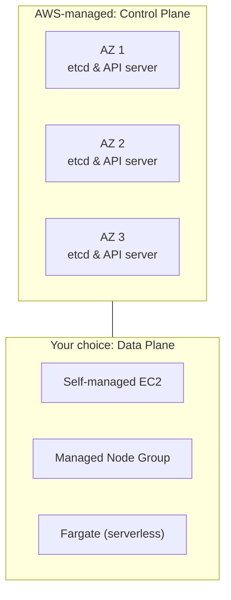

# 1. Amazon EKS Overview
*Section 2: EKS Basics · ~8 min*

## The problem with running Kubernetes yourself

Everything so far has been "vanilla" Kubernetes — you install it, and you own every piece of it. In practice, that means running and babysitting the **Control Plane** yourself: scaling master nodes across multiple Availability Zones, keeping `etcd` backed up and highly available, and performing zero-downtime version upgrades. If `etcd` dies, your cluster dies with it. That's a lot of operational weight for something that isn't your actual application.

**Amazon EKS (Elastic Kubernetes Service)** exists to take that weight off your hands.

## What AWS manages vs. what you manage

Kubernetes always has two halves — a **Control Plane** (the brain) and a **Data Plane** (the worker Nodes actually running your Pods). EKS splits ownership of these cleanly:

- **Control Plane — AWS manages it entirely.** AWS deploys it across **3 Availability Zones**, automatically replaces unhealthy master instances, handles version upgrades, and manages `etcd` backups for you.
- **Data Plane — you choose how much you manage.** EKS gives you three tiers of worker-node abstraction:

  1. **Self-Managed Nodes** — you provision plain EC2 instances, pick your own AMIs, and handle OS patching and upgrades yourself.
  2. **Managed Node Groups** — AWS gives you patched, optimized AMIs and rolls out upgrades with a single API call, automatically avoiding pod disruption.
  3. **AWS Fargate** — fully serverless. No EC2 instances to provision, patch, or scale at all — you just define Pods, and AWS runs them.




## Important: EKS is still "real" Kubernetes

EKS runs **upstream, open-source Kubernetes** — not a proprietary AWS fork. That means there's no vendor lock-in on your tooling: standard tools like `kubectl`, Helm, Prometheus, Grafana, and Fluentd work exactly the same on EKS as they do anywhere else. Any manifests or Helm charts you already have will deploy with little to no modification.

## Connecting to a cluster

Once a cluster exists, you point your local `kubectl` at it with:

```bash
aws eks update-kubeconfig --region <your-region> --name <cluster-name>
```

From there, you manage workloads exactly as you would on any other Kubernetes cluster.

## Plugged into the AWS ecosystem

EKS integrates natively with the rest of AWS — most notably:

- **IAM** — cluster security and access control.
- **Elastic Load Balancing (ELB)** — exposing Kubernetes Services to the internet.
- Deeper integrations also exist with API Gateway, Secrets Manager, CloudWatch, and CodePipeline.

## Key takeaways
- Running Kubernetes yourself means you own the Control Plane, including keeping `etcd` alive — EKS removes that burden entirely.
- **AWS manages** the Control Plane (across 3 AZs); **you choose** the Data Plane: Self-Managed EC2, Managed Node Groups, or Fargate.
- EKS runs **upstream Kubernetes** — no vendor lock-in, your existing tooling works unmodified.
- `aws eks update-kubeconfig` is how you point `kubectl` at a given EKS cluster.
- EKS integrates natively with IAM, ELB, CloudWatch, and more.

## FAQ

**Q: Does using EKS lock me into AWS-only Kubernetes tooling?**
A: No. EKS runs standard, open-source Kubernetes under the hood, so `kubectl`, Helm, Prometheus, and other standard tools all work exactly as they would on any other cluster.

**Q: What are my three options for running worker nodes on EKS?**
A: Self-Managed EC2 (you handle patching/AMIs yourself), Managed Node Groups (AWS handles patched AMIs and rolling upgrades), and Fargate (fully serverless — no EC2 to manage at all).

**Q: What's the single biggest operational difference between self-hosted Kubernetes and EKS?**
A: Who owns the Control Plane. Self-hosted means you're responsible for `etcd` and master-node availability yourself; with EKS, AWS manages, scales, and secures the Control Plane across multiple AZs automatically.

**Previous:** [← Section 1: 8. Declarative vs. Imperative](../01-kubernetes-basics/14_Declarative_vs._Imperative.md)
**Next:** [2. eksctl →](02_eksctl.md)
