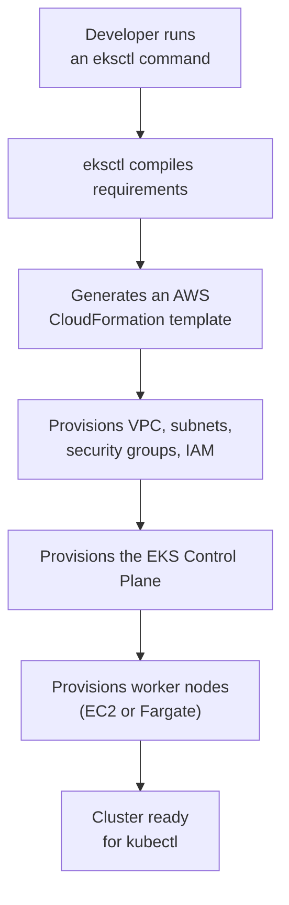

# 2. eksctl
*Section 2: EKS Basics · ~7 min*

## What eksctl is for

Provisioning an EKS cluster by hand through the AWS Console is tedious: you'd need to configure VPCs, public/private subnets, IAM roles, security groups, and node groups yourself, one by one.

**`eksctl`** is the official CLI tool for EKS that automates all of that. You give it a handful of simple parameters (node count, instance type, ...), and behind the scenes it compiles and deploys an **AWS CloudFormation** template that provisions everything for you — turning hours of manual setup into a single command.

`eksctl` is exclusively an **AWS EKS** tool — it cannot create clusters on GKE, AKS, or Minikube.

## eksctl vs. kubectl — don't mix these up

- **`eksctl` builds the infrastructure.** You use it to create the cluster itself, add EC2 nodes, configure VPCs, and set up IAM.
- **`kubectl` manages what runs inside that infrastructure.** Once the cluster exists, you switch to `kubectl` to deploy Pods, Services, and Deployments.

## ⚠️ The default command will cost you money

Running a bare `eksctl create cluster` provisions **two `m5.large` EC2 instances** by default — these are **not** Free Tier eligible and start billing immediately. Always specify a cheap instance type explicitly when practicing:

| Command | What it does | Note |
| --- | --- | --- |
| `eksctl create cluster` | Creates a default cluster | ⚠️ Don't use for practice — expensive `m5.large` nodes |
| `eksctl create cluster --name dev-cluster --version 1.21 --node-type t3.micro --nodes 2` | Cluster with 2 free-tier-eligible nodes | Good for learning |
| `eksctl create cluster --name dev-cluster --node-type t3.micro --nodes 2 --managed` | Same, but registered as a **Managed Node Group** | Offloads patching/lifecycle to AWS |
| `eksctl create cluster --name fargate-cluster --fargate` | Cluster with a Fargate profile | Handles the required private-subnet VPC setup automatically |
| `eksctl get clusters` | Lists clusters in the current region | Good for auditing |
| `eksctl delete cluster --name dev-cluster` | Tears down the cluster and its CloudFormation stacks | **Always run this when done**, or you'll keep getting billed |

## Fargate needs specific networking — eksctl handles it for you

AWS Fargate requires Pods to run in **private subnets**. If you build a cluster manually in the Console without that networking already in place, creating a Fargate profile afterward will simply fail. `eksctl` calculates and provisions the exact VPC/subnet layout Fargate needs, automatically, from the start.

## Best practices

- **Always set `--node-type` explicitly** — don't rely on the expensive default.
- **Use `--managed`** so AWS handles node patching and lifecycle for you.
- **Move to declarative YAML for real projects** — CLI flags are fine for learning, but the industry standard is defining your cluster config in a YAML file (`eksctl create cluster -f cluster.yaml`) so it's version-controlled, like any other infrastructure-as-code.

## Common mistakes

- **Mixing up the tools** — trying to deploy a Pod with `eksctl`, or trying to build a VPC with `kubectl`.
- **Deleting EC2 instances manually in the Console** instead of running `eksctl delete cluster` — this breaks the CloudFormation stack and leaves orphaned, still-billing resources (like NAT Gateways) behind.

## Key takeaways
- `eksctl` turns complex AWS infrastructure setup into a single command by generating and running CloudFormation templates for you.
- It is strictly an **AWS EKS** tool for **infrastructure** — actual Kubernetes workloads still go through `kubectl`.
- The default `eksctl create cluster` is not free-tier friendly — always set `--node-type` and `--nodes` explicitly.
- Always tear clusters down with `eksctl delete cluster`, never by manually deleting EC2 instances.

## FAQ

**Q: What actually happens in AWS when I run `eksctl create cluster`?**
A: `eksctl` compiles your parameters into an AWS CloudFormation template and submits it. CloudFormation then provisions the VPC, subnets, security groups, the EKS Control Plane, and the worker nodes — all from that one template.

**Q: Why would a Fargate profile fail if I build the cluster manually in the AWS Console first?**
A: Fargate requires Pods to launch in private subnets with the right networking (like NAT gateways) already in place. A manually built cluster often doesn't have that set up correctly. `eksctl --fargate` configures the required VPC/subnet layout automatically from the start.

**Q: If a cluster creation fails partway through, am I left with a pile of half-built, billable resources?**
A: Usually not — `eksctl` typically rolls back the underlying CloudFormation stack automatically when creation fails (e.g., due to account limits or IAM permission issues).

**Previous:** [← 1. Amazon EKS Overview](01_EKS_Overview.md)
**Next:** [3. kubectl →](03_Kubectl.md)
