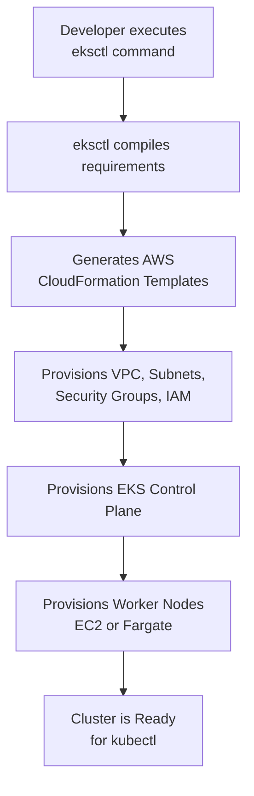
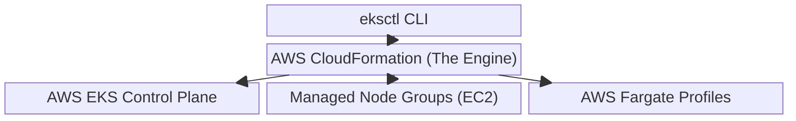

# Amazon EKS Management with eksctl

## Overview

`eksctl` is the official, open-source command-line interface (CLI) tool for Amazon EKS. It acts as an automation engine that abstracts the heavy lifting of AWS infrastructure creation, allowing you to spin up and manage complete Kubernetes clusters with a single command.

## Why This Matters

Provisioning an EKS cluster via the AWS Management Console is a tedious, multi-step process. You must manually configure VPCs, public/private subnets, IAM roles, Security Groups, and Node Groups. `eksctl` automates all of this by automatically compiling and deploying AWS CloudFormation templates on your behalf, reducing hours of manual infrastructure setup into a single terminal command.

## Key Concepts

* **Infrastructure Abstraction:** You provide simple parameters (like node count and instance type), and `eksctl` translates them into complex AWS CloudFormation stacks under the hood.
* **Targeted Scope:** `eksctl` is exclusively built for Amazon EKS. It cannot be used to create clusters on Google Kubernetes Engine (GKE), Azure Kubernetes Service (AKS), or local Minikube environments.
* **Fargate Automation:** AWS Fargate (serverless pods) requires strict networking rules, like existing strictly in private subnets. `eksctl` handles all this networking prerequisite logic automatically when a Fargate profile is requested.

## Detailed Notes

**The AWS Console vs. CLI Experience**
If you attempt to create a Fargate-backed cluster using the AWS Console, you must first create the cluster, then create a Fargate profile. If your cluster wasn't originally provisioned with the correct private subnet architecture, the Fargate profile creation will fail. `eksctl` prevents this by calculating and provisioning the exact VPC and subnet architecture required for Fargate automatically.

**The Danger of the Default Command**
Executing a bare `eksctl create cluster` command is dangerous for your AWS bill. By default, `eksctl` provisions two `m5.large` EC2 instances for your worker nodes. These instances do **not** fall under the AWS Free Tier and will incur immediate hourly charges. Always explicitly define your node instance types (e.g., `t3.micro`) when practicing.

**eksctl vs. kubectl**
It is vital to understand the boundary between these two tools:

* **`eksctl` provisions the AWS infrastructure.** You use it to create the cluster, add EC2 nodes, configure VPCs, and set up IAM.
* **`kubectl` manages the K8s resources inside the cluster.** Once the cluster exists, you switch to `kubectl` to deploy pods, services, and deployments.

## Workflow

## Architecture Diagram

## Step-by-Step Process

1. **Install Prerequisites:** Ensure you have the AWS CLI configured with valid IAM credentials, alongside `kubectl` and `eksctl` installed locally.
2. **Define Cluster Parameters:** Decide your cluster name, Kubernetes version, node count, and instance type (e.g., free-tier eligible `t3.micro`).
3. **Execute Cluster Creation:** Run your targeted `eksctl` command.
4. **Wait for CloudFormation:** `eksctl` will output logs as it spins up CloudFormation stacks. This typically takes 15-20 minutes.
5. **Verify Access:** Once complete, `eksctl` automatically updates your local `kubeconfig` file. Test the connection by running `kubectl get svc`.

## Commands and Examples

| Command | Description | Warning / Note |
| --- | --- | --- |
| `eksctl create cluster` | Creates a default EKS cluster. | ⚠️ **DO NOT USE FOR PRACTICE.** Provisions expensive `m5.large` nodes. |
| `eksctl create cluster --name dev-cluster --version 1.21 --node-type t3.micro --nodes 2` | Creates a cluster with 2 free-tier eligible worker nodes. | Best for general learning and testing. |
| `eksctl create cluster --name dev-cluster --node-type t3.micro --nodes 2 --managed` | Creates a cluster and explicitly registers the EC2 instances as an AWS Managed Node Group. | Offloads patching and node lifecycle management to AWS. |
| `eksctl create cluster --name fargate-cluster --fargate` | Creates a cluster and provisions a Fargate profile. | Automatically handles complex private subnet VPC requirements. |
| `eksctl get clusters` | Lists all EKS clusters deployed in your current AWS region. | Useful for auditing environments. |
| `eksctl delete cluster --name dev-cluster` | Tears down the cluster and deletes all associated CloudFormation stacks. | Always run this when finished testing to avoid zombie AWS charges. |

## Best Practices

* **Always Define Node Types:** Never rely on default instances; explicitly declare `--node-type` to control your AWS billing.
* **Use Managed Node Groups:** Always append the `--managed` flag when provisioning EC2 nodes to ensure AWS handles lifecycle management and AMI patching.
* **Use Declarative YAML (Industry Standard):** While the CLI flags are great for learning, industry best practice is to define your `eksctl` cluster parameters in a declarative YAML file (e.g., `eksctl create cluster -f cluster.yaml`) to enable Infrastructure as Code and version control.

## Common Mistakes

* **Confusing CLIs:** Trying to deploy a K8s Pod using `eksctl`, or trying to create an AWS VPC using `kubectl`.
* **Forgetting to Delete:** Deleting the EC2 instances manually in the AWS Console instead of running `eksctl delete cluster`. Manual deletion breaks the CloudFormation stack, leaving orphaned resources (like NAT Gateways) that continue to bill you.
* **Cross-Cloud Assumptions:** Attempting to use `eksctl` to manage non-AWS Kubernetes environments.

## Pro Tips

* If a cluster creation fails mid-way (often due to AWS account limits or IAM permissions), `eksctl` will usually roll back the CloudFormation stack automatically to ensure you aren't left with half-built, billable infrastructure.

## Real-World Use Cases

* **Rapid Prototyping:** A DevOps engineer needs to test a new Helm chart and spins up an ephemeral cluster in 15 minutes without writing a single line of Terraform.
* **CI/CD Pipeline Automation:** Integrating `eksctl` into GitHub Actions or Jenkins to automatically provision temporary EKS environments for end-to-end integration testing, then destroying them post-test.
* **Fargate Architectures:** Quickly establishing strict serverless container environments where developers are entirely abstracted away from managing EC2 instances.

## Key Takeaways

* `eksctl` abstracts complex AWS networking and provisioning into single, readable commands.
* It operates by generating and executing AWS CloudFormation templates.
* It is strictly an AWS EKS tool; K8s resource management still requires `kubectl`.
* Always specify your node types (`t3.micro`) to avoid unexpected AWS bills from default `m5.large` instances.

## Glossary

* **eksctl:** The official CLI tool for creating and managing Amazon EKS clusters and underlying AWS infrastructure.
* **kubectl:** The Kubernetes command-line tool used to run commands against Kubernetes clusters (deployments, pods, services).
* **CloudFormation:** An AWS service that uses declarative configuration files to automate the setup and deployment of AWS infrastructure.
* **Node Group:** A logical grouping of EC2 instances that serve as worker nodes for an EKS cluster.
* **Fargate Profile:** A configuration that tells EKS which pods should run on serverless AWS Fargate compute instead of standard EC2 nodes.

## Revision Notes

* **EKS Infrastructure Creation?** Use `eksctl`.
* **K8s Application Deployment?** Use `kubectl`.
* **Default EC2 type?** `m5.large` (Not free!).
* **Fargate networking?** Handled automatically by `eksctl` (forces private subnets).

## Interview Questions

**Q: Explain the difference between `eksctl` and `kubectl`.**
A: `eksctl` is an AWS-specific tool used to provision and manage the underlying cloud infrastructure of an EKS cluster (like EC2 nodes, VPCs, and IAM roles). `kubectl` is the universal Kubernetes tool used to manage the actual workloads (Pods, Services, Deployments) running *inside* that infrastructure.

**Q: What is actually happening in AWS when you execute an `eksctl create cluster` command?**
A: `eksctl` compiles your parameters and generates AWS CloudFormation templates. It submits these templates to AWS, which then orchestrates the creation of the VPC, subnets, security groups, the EKS Control Plane, and the worker nodes.

**Q: Why might a Fargate profile creation fail if you build an EKS cluster manually in the console, and how does `eksctl` solve this?**
A: Fargate requires pods to be launched in private subnets. If you manually create an EKS cluster without properly configuring private subnets with NAT gateways, the Fargate profile will fail. `eksctl` abstracts this by automatically designing and provisioning a VPC with the exact private subnet requirements needed for Fargate from the start.

## Practice Exercises

1. **Draft a Safe Command:** Write the exact terminal command to create an EKS cluster named `my-test-cluster`, running Kubernetes version `1.22`, utilizing three free-tier eligible `t3.micro` EC2 instances, ensuring they are managed by AWS.
2. **Identify the Error:** A junior developer complains that their K8s deployments are failing. They show you their terminal history: `eksctl apply -f nginx-deployment.yaml`. Explain to the developer why this command failed and what they should use instead.
