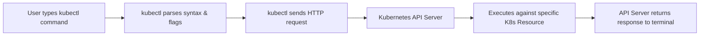
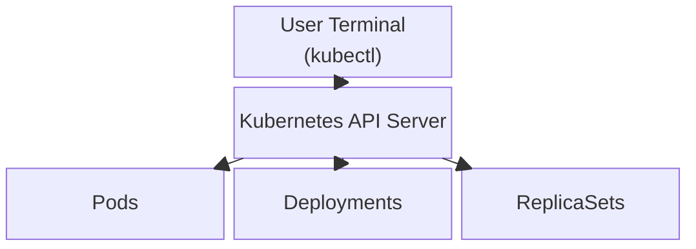

# Chapter Title: Mastering Kubectl

## Overview

`kubectl` is the official command-line interface (CLI) for running commands against Kubernetes clusters. It serves as the primary gateway for users to interact with the Kubernetes API and manage cluster resources such as Pods, Deployments, and ReplicaSets.

## Why This Matters

If Kubernetes is the engine, `kubectl` is the steering wheel. Whether you are running a local testing environment, a managed cloud service like Amazon EKS, or an on-premises enterprise cluster, `kubectl` remains the universal standard for deploying and troubleshooting applications.

## Key Concepts

* **The Universal Translator:** `kubectl` communicates directly with the Kubernetes API server to perform actions.
* **Platform Agnostic:** Unlike provider-specific CLI tools, `kubectl` works identically across any Kubernetes environment (e.g., AWS EC2, Fargate, Google Kubernetes Engine, or on-premises servers).
* **Resource-Centric:** `kubectl` specifically interacts with Kubernetes *resources* (like Pods and Deployments).

* **`eksctl vs kubectl`**:  `eksctl` (The Builder) Used to set up and manage the physical **AWS infrastructure** (the servers, clusters, and node groups) where your system lives. You use this mostly during setup.
  **`kubectl` (The Operator):** Used to deploy and manage the **applications** running *inside* that infrastructure on a daily basis.

### Quick Comparison

| Tool | Focus | What it handles |
| --- | --- | --- |
| **`eksctl`** | **Infrastructure** | AWS servers, clusters, and node groups |
| **`kubectl`** | **Applications** | Code, deployments, and services running inside the cluster |
---

### The Restaurant Analogy

* **`eksctl` is like the construction company.**
* It builds the restaurant building, sets up the kitchen, installs the electricity, and builds the tables and chairs (this is your **infrastructure**). You usually only use it when you are first building the place or need to expand it.

* **`kubectl` is like the restaurant manager.**
* Once the building is ready, the manager runs what happens *inside*. They hire the staff, decide what goes on the menu, seat customers, and cook the food (these are your **applications**). You use `kubectl` every single day to manage your apps.

## Detailed Notes

### The Command Syntax

Every `kubectl` command follows a strict structural pattern: `kubectl [command] [type] [name] [flags]`.

* **Command:** The action you want to perform on one or more resources. Common examples include `get`, `create`, `describe`, `delete`, and `apply`.
* **Type:** The Kubernetes resource type you are targeting. Resource types can be written in singular, plural, or abbreviated forms (e.g., `pod`, `pods`, or `po`).
* **Name:** The specific, case-sensitive name of the resource you want to interact with. If you omit the name parameter, `kubectl` will return information for *all* resources of that type.
* **Flags:** Optional modifiers used to adjust the command's behavior or output format. Examples include `-f` for specifying a filename or `-o yaml` to output the details in YAML format.

## Workflow

## Architecture Diagram

## Step-by-Step Process

1. **Define the Action:** Decide what you need to do (e.g., `get` information).
2. **Identify the Resource:** Determine the type of resource (e.g., `pod`).
3. **Target the Resource:** Provide the specific resource name (e.g., `pod1`), or leave it blank to query all of them.
4. **Apply Formatting:** Add any necessary flags (e.g., `-o yaml` for readable configuration output).
5. **Execute:** Run the command to interact with the API server.

## Commands and Examples

| Command Structure | Description |
| --- | --- |
| `kubectl get pods` | Retrieves a summary list of all pods running in the active namespace. |
| `kubectl get po` | Performs the exact same action as above using the abbreviated resource type. |
| `kubectl get pod pod1` | Retrieves the status of a single, specific pod named "pod1". |
| `kubectl get pod pod2 -o yaml` | Retrieves information about "pod2" and formats the detailed output in YAML. |
| `kubectl create -f manifest.yaml` | Creates a resource using the configuration defined in the specified file. |

## Best Practices

* **Use Abbreviations:** Save time typing by memorizing common abbreviations (`po` for pods, `deploy` for deployments, `ns` for namespaces).
* **Utilize YAML Outputs:** When troubleshooting, always append `-o yaml` to your `get` commands. It reveals the complete underlying configuration of the resource, which is hidden in the standard summary view.
* **Rely on the Docs:** You do not need to memorize every command instantly. Rely on the official Kubernetes documentation or the built-in CLI help (`kubectl [command] --help`).

## Common Mistakes

* **Confusing `eksctl` with `kubectl`:** Trying to use `kubectl` to provision AWS infrastructure, or using `eksctl` to deploy a web application pod.
* **Forgetting Namespaces:** If you run a command and cannot find your expected resource, you are likely querying the wrong namespace.
* **Syntax Ordering:** Placing flags before the command or type (e.g., `kubectl -o yaml get pod`), which will cause syntax errors.

## Pro Tips

* If you omit the specific resource name from a `get` command, Kubernetes will aggressively fetch and display every single resource of that type in the current namespace. This is excellent for auditing your environment.

## Real-World Use Cases

| Role | Scenario | Kubectl Application |
| --- | --- | --- |
| **Developer** | Verifying an application deployed correctly. | Running `kubectl get pods` to ensure the pod is in a "Running" state. |
| **DevOps Engineer** | Debugging a crashing pod. | Running `kubectl get pod [name] -o yaml` to inspect the configuration and find missing environment variables. |
| **System Admin** | Applying a new infrastructure update. | Running `kubectl apply -f deployment.yaml` to push new code to the cluster. |

## Key Takeaways

* `kubectl` is the universal tool for communicating with any Kubernetes API server.
* The syntax is rigidly structured: `kubectl [command] [type] [name] [flags]`.
* Resource types can be abbreviated for efficiency.
* Flags are incredibly powerful tools for modifying inputs and formatting outputs.

## Glossary

* **API Server:** The central control plane component that `kubectl` talks to in order to modify or query the cluster.
* **CLI (Command-Line Interface):** A text-based interface used to run software and operating system commands.
* **Manifest File:** A YAML or JSON file containing the desired state configuration for Kubernetes resources.

## Revision Notes

* **What is it?** The universal K8s CLI.
* **Who does it talk to?** The Kubernetes API Server.
* **Syntax Order:** `Command` $\rightarrow$ `Type` $\rightarrow$ `Name` $\rightarrow$ `Flags`.
* **Missing Name?** Returns *all* resources of that type.

## Interview Questions

**Q: What is the difference between `eksctl` and `kubectl`?**
A: `eksctl` is an AWS-specific tool used to provision and manage the actual EKS cluster infrastructure and worker nodes. `kubectl` is a universal tool used to deploy, manage, and inspect the Kubernetes resources (like Pods and Deployments) running inside that cluster.

**Q: Can you explain the standard syntax structure of a `kubectl` command?**
A: A typical command is structured as `kubectl [command] [type] [name] [flags]`. The `command` is the action (like `get` or `create`), the `type` is the resource (like `pod`), the `name` identifies the specific resource, and `flags` modify the command's behavior (like `-o yaml`).

**Q: What happens if you run `kubectl get pod` without specifying a pod name?**
A: If the resource name is omitted, `kubectl` will return a list of all available pods in the active namespace.

## Practice Exercises

1. **Syntax Breakdown:** Write down the command `kubectl describe deploy web-server -n production`. Identify which part of the command matches the `command`, `type`, `name`, and `flags` syntax slots.

**Question:** Break down the command `kubectl describe deploy web-server -n production`. Identify which parts of the command match the `command`, `type`, `name`, and `flags` syntax slots.
**Answer:**

* **Command:** `describe` (the action to perform)
* **Type:** `deploy` (the resource type, abbreviated for deployment)
* **Name:** `web-server` (the specific target resource)
* **Flags:** `-n production` (the modifier targeting a specific namespace)

2. **Abbreviation Challenge:** Look up the Kubernetes abbreviations for `services`, `replicasets`, and `namespaces`. Write a mock command to `get` all of them using only their shortened names.
**Question:** Look up the Kubernetes abbreviations for `services`, `replicasets`, and `namespaces`. Write a mock command to `get` all of them using only their shortened names.
**Answer:**

* `services` = `svc`
* `replicasets` = `rs`
* `namespaces` = `ns`
* **Command:** `kubectl get svc,rs,ns`

