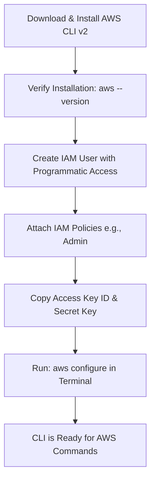
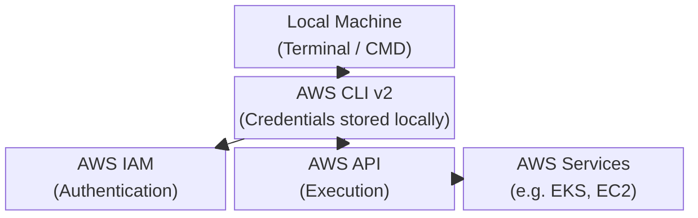

# Chapter Title: AWS CLI Installation and Configuration

## Overview

The AWS Command Line Interface (CLI) is an essential tool for interacting with AWS services directly from your terminal. This chapter covers the installation of the AWS CLI v2 and the configuration of IAM user credentials to enable programmatic access to your AWS environment.

## Why This Matters

While the AWS Management Console is user-friendly, real-world DevOps workflows rely entirely on automation and scripting. The AWS CLI allows you to execute commands, provision infrastructure, and interact with services like EKS programmatically. Securing this access through proper IAM credential configuration is the foundational step for any cloud engineer.

## Key Concepts

* **AWS CLI v2:** The official tool to manage AWS services from the command line.
* **IAM User:** An Identity and Access Management user created specifically for programmatic access rather than console login.
* **Access Keys:** The combination of an Access Key ID and Secret Access Key used to authenticate programmatic requests.
* **aws configure:** The core command used to set up your local environment with credentials, default region, and output format.

## Detailed Notes

**Installation Methods**

* **Windows:** The recommended visual approach is using the MSI installer, which automatically adds the CLI to your system path.
* **macOS/Linux:** Typically installed via command-line scripts or package managers.
* **Modern Single-Line Installers:** AWS has recently simplified installations. You can use single-line commands (like `curl` scripts for Linux/Mac or `irm` for PowerShell) to install the CLI directly. Additionally, starting with version 2.36.0, you can upgrade the CLI simply by running `aws update`.

**IAM User Configuration**
Before the CLI can perform actions, it needs permissions.

* Create an IAM User with "Programmatic access".
* Attach appropriate policies (e.g., `AdministratorAccess` for full control during learning).
* Download or copy the Access Key ID and Secret Access Key immediately; you will not be able to view the secret key again once you leave the creation screen.

**Setting Up the CLI**
Once installed, use the command prompt (CMD, PowerShell, or bash) to verify the installation with `aws --version`. Then, initialize the setup using `aws configure`.

## Workflow

## Architecture Diagram

## Step-by-Step Process

1. Install the AWS CLI using the appropriate installer for your OS.
2. Open a terminal and run `aws --version` to confirm success.
3. Log into the AWS Console, navigate to IAM, and click "Add user".
4. Select "Programmatic access" and attach the "AdministratorAccess" policy.
5. Copy the generated Access Key ID and Secret Access Key.
6. Open your terminal and run `aws configure`.
7. Paste the Access Key ID, Secret Access Key, and define your default region (e.g., `us-east-1`).

## Commands and Examples

| Command | Description |
| --- | --- |
| `aws --version` | Checks the installed version of the AWS CLI. |
| `aws configure` | Initiates the interactive prompt to set up your local credentials. |
| `aws update` | Upgrades the CLI to the latest version (supported in v2.36.0 and later). |

## Best Practices

* **Principle of Least Privilege:** While Administrator access is fine for sandboxed learning, always restrict IAM policies to only the exact permissions needed for real-world applications.
* **Credential Management:** Never hardcode or commit your Secret Access Key into a Git repository.
* **Use Single-Line Installers:** For faster setup in automated environments, use the modern single-line installation scripts provided by AWS.

## Common Mistakes

* **Losing the Secret Key:** Failing to download the CSV or copy the Secret Access Key during IAM user creation. Once the page is closed, the key cannot be recovered; you must generate a new one.
* **Using Root Credentials:** Never configure your CLI using your AWS account's root credentials. Always create a dedicated IAM user.

## Pro Tips

* The credentials you input via `aws configure` are stored locally on your machine in plain text within a hidden folder (`~/.aws/credentials` on Mac/Linux, or `C:\Users\USERNAME\.aws\credentials` on Windows).

## Real-World Use Cases

| Scenario | Usage |
| --- | --- |
| **CI/CD Pipelines** | Using programmatic access keys within Jenkins or GitHub Actions to automatically deploy code to AWS. |
| **Infrastructure as Code** | Terraform and `eksctl` both rely on the underlying AWS CLI configuration to authenticate and provision resources. |

## Key Takeaways

* The AWS CLI allows command-line management of AWS resources.
* Programmatic access requires an IAM user with an Access Key ID and Secret Access Key.
* `aws configure` is the essential command linking your local terminal to your AWS account.

## Glossary

* **AWS CLI:** Amazon Web Services Command Line Interface.
* **IAM:** Identity and Access Management; controls who is authenticated and authorized to use resources.
* **Programmatic Access:** Access type that provides an access key ID and secret access key for development tools.

## Revision Notes

* Install via MSI (Windows) or script (Linux/Mac).
* Update via `aws update`.
* Setup requires IAM Access Keys.
* Run `aws configure` to bind keys to your terminal.

## Interview Questions

**Q: What is the purpose of `aws configure`?**
A: It sets up your local AWS CLI installation by storing your IAM Access Key ID, Secret Access Key, default region, and output format so you can securely interact with AWS APIs.

**Q: What happens if you lose your IAM Secret Access Key?**
A: You cannot recover it. You must log into the AWS Console, delete or deactivate the lost key, and generate a new pair.

## Practice Exercises

**1. Verifying CLI Setup**
**Question:** After running `aws configure` and inputting your keys, how can you test that your CLI is successfully communicating with AWS?
**Answer:**

* **Step 1:** Open your terminal.
* **Step 2:** Run a basic read-only AWS command, such as `aws iam get-user`.
* **Step 3:** If the command returns your IAM user details in JSON format, the CLI is correctly authenticated.
