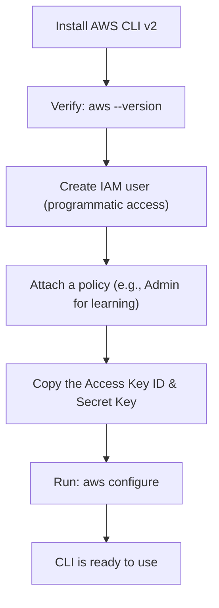

# 4. AWS CLI Installation & Configuration
*Section 2: EKS Basics · ~5 min*

## Why you need it

The AWS Console is fine for clicking around, but real DevOps workflows run on automation and scripting. The **AWS CLI** lets you script and execute AWS operations — including everything `eksctl` needs — directly from your terminal. Before any of that works, it needs to be installed and pointed at a valid set of credentials.

## Step 1: Install the AWS CLI v2

- **Windows:** the MSI installer is the easiest route — it adds the CLI to your system PATH automatically.
- **macOS/Linux:** typically via a package manager or a install script.
- **Modern shortcut:** AWS also offers single-line installers (`curl` for Linux/Mac, `irm` for PowerShell). From v2.36.0 onward, you can even upgrade in place with `aws update`.

Verify it worked:

```bash
aws --version
```

## Step 2: Create an IAM user for programmatic access

Never configure the CLI with your AWS account's **root** credentials. Instead:

1. In the AWS Console, go to IAM → create a new user with **programmatic access**.
2. Attach a policy — `AdministratorAccess` is fine for learning; in real projects, follow least privilege and grant only what's needed.
3. Copy the **Access Key ID** and **Secret Access Key** immediately. Once you leave that screen, **the secret key cannot be viewed again** — you'd have to generate a new one.

## Step 3: Wire the CLI to those credentials

```bash
aws configure
```

This interactive prompt asks for your Access Key ID, Secret Access Key, default region (e.g. `us-east-1`), and output format — then stores them locally (in plain text, under `~/.aws/credentials` on Mac/Linux or `C:\Users\<you>\.aws\credentials` on Windows).



## Best practices

- **Least privilege** — Admin access is fine for a learning sandbox, but production IAM policies should grant only what's actually needed.
- **Never commit credentials** — don't hardcode or check your Secret Access Key into a Git repo.
- **Prefer single-line installers** for fast, repeatable setup in automated environments.

## Common mistakes

- **Losing the secret key** — if you close the creation screen without copying it, it's gone for good; you must generate a new key pair.
- **Using root credentials** — always create a dedicated IAM user instead.

## Key takeaways
- Install AWS CLI v2 → verify with `aws --version` → create an IAM user with programmatic access → run `aws configure`.
- The Secret Access Key is shown **exactly once** — copy it immediately or you'll have to regenerate it.
- `eksctl` and Terraform both rely on this same underlying AWS CLI configuration to authenticate.

## FAQ

**Q: What does `aws configure` actually do?**
A: It stores your IAM Access Key ID, Secret Access Key, default region, and output format locally, so every future AWS CLI (and `eksctl`) command can authenticate automatically.

**Q: I lost my Secret Access Key — can I retrieve it?**
A: No. You'll need to go into IAM, deactivate/delete the old key, and generate a brand-new key pair.

**Q: How do I confirm the CLI is actually authenticated correctly?**
A: Run a simple read-only command, like `aws iam get-user`. If it returns your IAM user details in JSON, you're set up correctly.

**Previous:** [← 3. kubectl](03_Kubectl.md)
**Next:** [5. Installing kubectl on Windows →](05_kubectl_Installation_Windows.md)
