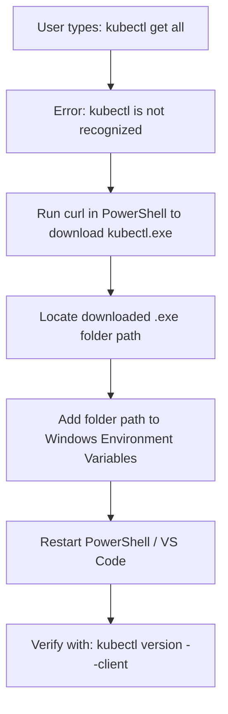
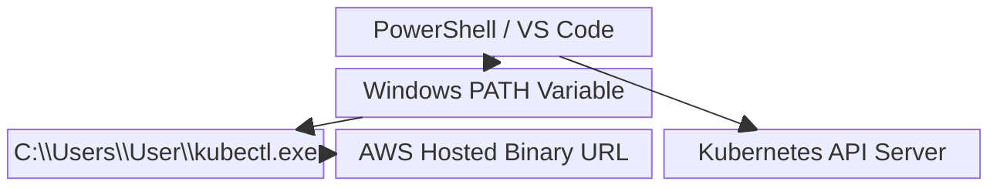
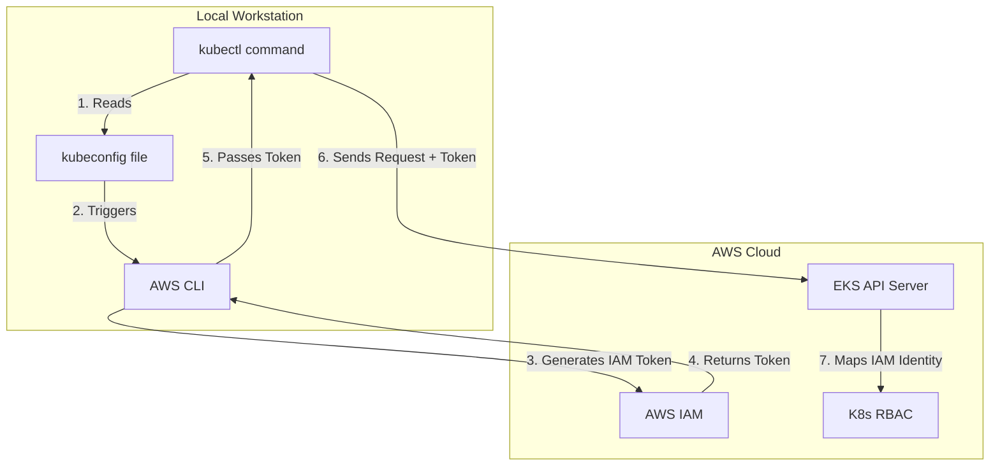

# Chapter Title: Installing kubectl (Windows)

## Overview

While `kubectl` works universally across any Kubernetes cluster, it must be installed locally on your operating system before you can communicate with the API server. This chapter covers the manual installation of the Amazon-vended `kubectl` binary on a Windows environment and configuring the system path to ensure the command is recognized globally.

## Why This Matters

Without `kubectl`, you cannot interact with Kubernetes resources from your local machine. By properly downloading the executable and mapping its location to your operating system's environment variables, you enable seamless execution of Kubernetes commands directly from any terminal, such as PowerShell or the integrated terminal in Visual Studio Code.

## Key Concepts

* **Binary Execution:** `kubectl` is distributed as a standalone executable file (`kubectl.exe` on Windows). It does not require a complex installation wizard.
* **System PATH:** An environment variable in Windows that tells the command line where to look for executable files. If the folder containing `kubectl.exe` is not in your PATH, your terminal will throw a "not recognized" error.
* **Amazon-Vended kubectl:** AWS provides officially maintained binaries of `kubectl` that are tested specifically for compatibility with Amazon EKS.

## Detailed Notes

If you attempt to run `kubectl get all` on a fresh machine, Windows will return an error stating the command is not recognized. To resolve this:

1. **Download the Binary:** Use the official AWS EKS documentation to find the specific `curl` command for your operating system. For Windows, running this command in PowerShell downloads the `kubectl.exe` file directly to your current working directory (often `C:\Users\<YourUsername>`).
2. **Configure the PATH:** Downloading the file is not enough. You must copy the directory path where the `.exe` file resides and add it to your Windows Environment Variables under the `Path` variable. You can append this to either the System variables (for all users) or your specific User variables.
3. **Restart the Terminal:** Environment variables are loaded into memory strictly when a terminal session starts. After updating your PATH, you must completely close and reopen PowerShell or VS Code for the new `kubectl` command to be recognized.

## Workflow



## Architecture Diagram



## Step-by-Step Process

1. Open PowerShell (or the VS Code integrated PowerShell terminal).
2. Run the `curl` command provided in the AWS documentation to download `kubectl.exe` to your machine.
3. Locate the downloaded `kubectl.exe` file in your file explorer.
4. Copy the folder path of that directory.
5. Open the Windows Start Menu, search for **"Environment Variables"**, and click **"Edit the system environment variables"**.
6. Click the **Environment Variables** button.
7. Under "User variables", find and select **Path**, then click **Edit**.
8. Click **New**, paste the folder path you copied earlier, and click **OK** on all windows to save.
9. Close your current terminal entirely and open a fresh one to reload the environment variables.
10. Run `kubectl version --client` to verify the installation.

## Commands and Examples

| Command | Description |
| --- | --- |
| `curl.exe -O <URL>` | The standard method for downloading the `kubectl` binary directly from AWS via PowerShell. |
| `kubectl version --client` | Checks the locally installed client version of `kubectl` to confirm it is successfully recognized by the system. |
| `kubectl version --short --client` | An older flag syntax used to print a condensed version string (note: `--short` is deprecated in newer releases but functions similarly if supported). |

## Best Practices

* **Use VS Code:** Managing your Kubernetes YAML manifests and running your terminal inside Visual Studio Code provides a unified, highly efficient workspace.
* **Match Versions:** While `kubectl` supports version skew, aim to keep your local `kubectl` client version within one minor release of your remote EKS cluster's version to avoid compatibility warnings.

## Common Mistakes

* **Forgetting to Restart the Terminal:** Updating the Windows PATH will not affect currently open terminal windows. You must close and reopen VS Code or PowerShell to load the updated PATH.
* **Adding the File Instead of the Folder:** When editing the PATH variable, you must paste the *directory path* (e.g., `C:\Users\Admin\`), not the direct path to the file itself (`C:\Users\Admin\kubectl.exe`).

## Pro Tips

* While the manual binary installation is standard, modern Windows users can also leverage package managers like `winget` or Chocolatey (e.g., `winget install Kubernetes.kubectl`) to handle downloading and PATH configuration in a single command.

## Real-World Use Cases

| Scenario | Usage |
| --- | --- |
| **New Workstation Setup** | A DevOps engineer receives a new Windows laptop and must manually install the CLI tooling before they can manage the company's EKS infrastructure. |
| **Local Development** | A developer installs `kubectl` to interact with both local testing environments (like Docker Desktop) and remote AWS clusters from the same machine. |

## Key Takeaways

* `kubectl` must be installed locally and explicitly added to the operating system's PATH variable on Windows.
* AWS provides official installation instructions and binaries optimized for EKS.
* Terminals must be restarted after PATH modifications for the new configurations to take effect.

## Glossary

* **curl:** A command-line tool used to transfer data from or to a server, frequently used to download binaries from URLs.
* **Environment Variable:** Dynamic values stored by the OS that dictate how running processes behave on a computer.
* **PATH:** A specific environment variable specifying the directories in which executable programs are located.

## Revision Notes

* Download `kubectl.exe`.
* Copy the folder path (not the file path).
* Add the folder path to the Windows `Path` variable.
* Restart the terminal and run `kubectl version --client`.

## Interview Questions

**Q: If you download `kubectl.exe` but your terminal still says "command not recognized," what is the most likely issue?**
A: The folder containing the executable has not been added to the system's `PATH` environment variable, or the terminal session was not restarted after updating the PATH.

**Q: Why does AWS provide its own documentation and download links for `kubectl`?**
A: AWS provides Amazon-vended binaries that are specifically tested and validated to work securely and seamlessly with Amazon EKS clusters.

## Practice Exercises

**1. Verifying Installation Paths**
**Question:** You have successfully downloaded `kubectl.exe` to `C:\Tools\K8s\kubectl.exe`. You open your Windows Environment Variables to configure your Path. Exactly what string should you paste into the new Path entry?
**Answer:**

* You must paste the directory path, not the file path.
* **Correct entry:** `C:\Tools\K8s\` (or `C:\Tools\K8s`)

**2. Troubleshooting the Terminal**
**Question:** A colleague followed the installation instructions perfectly, added the folder to their PATH, and clicked OK. They immediately typed `kubectl version --client` into their open VS Code terminal, but it threw a "not recognized" error. How do you instruct them to fix this?
**Answer:**

* **Step 1:** Instruct them to close the current VS Code terminal instance completely (or restart VS Code).
* **Step 2:** Open a fresh terminal session. This forces the terminal to fetch the newly updated environment variables from the OS.
* **Step 3:** Run `kubectl version --client` again.

### AWS Integration

To interact with an Amazon EKS cluster, `kubectl` must securely authenticate through AWS Identity and Access Management (IAM). Because `kubectl` is an open-source tool that does not natively understand AWS IAM, it relies on a local handoff process involving the AWS CLI and a configuration file to bridge the gap.

**The Authentication & Authorization Flow**



**How the Components Integrate**

* **The `kubeconfig` File:** This local file (typically located at `~/.kube/config`) acts as the bridge. When you connect to an EKS cluster using `aws eks update-kubeconfig`, AWS writes the cluster's API endpoint, certificate authority, and an `exec` block into this file.
* **The Helper Process (`aws eks get-token`):** When you type a command like `kubectl get pods`, `kubectl` reads the `kubeconfig` file. The `exec` block inside the file instructs `kubectl` to temporarily pause and trigger the AWS CLI in the background. The AWS CLI uses your local IAM credentials to generate a short-lived (15-minute) secure authentication token.
* **The API Handoff:** The AWS CLI passes this token back to `kubectl`. `kubectl` then injects the token into an HTTPS authorization header and fires the request at the EKS API Server.
* **Authentication vs. Authorization:**
* **Authentication (Who are you?):** The EKS API Server receives the token and asks AWS IAM to verify it. IAM confirms your identity (e.g., `AdminUser`).
* **Authorization (What can you do?):** EKS then maps your IAM identity to Kubernetes native Role-Based Access Control (RBAC). Even if IAM says your token is valid, if K8s RBAC does not grant your user the rights to view Pods, the API server will reject the request.


**Under the Hood: The Kubeconfig Execution Block**
Here is what the integration looks like inside your `kubeconfig` file. Notice how `kubectl` relies on the `aws` CLI command to fetch the token dynamically.

```yaml
users:
- name: arn:aws:eks:us-east-1:1234567890:cluster/dev-cluster
  user:
    exec:
      apiVersion: client.authentication.k8s.io/v1beta1
      command: aws
      args:
      - --region
      - us-east-1
      - eks
      - get-token
      - --cluster-name
      - dev-cluster

```

**FAQ: EKS Integration**

**Q: Does `kubectl` store my AWS IAM credentials?**
**A:** No. `kubectl` never sees your AWS Access Keys. It delegates the authentication process entirely to the AWS CLI, which securely manages your IAM keys and only hands a temporary token back to `kubectl`.

**Q: If I have full AWS Administrator access in IAM, do I automatically have full access to Kubernetes resources?**
**A:** No. IAM only handles *authentication* (getting through the front door). Once inside, Kubernetes RBAC dictates your *authorization*. The only exception is the IAM entity (user or role) that originally created the EKS cluster; this creator is automatically granted permanent, hidden `system:masters` (super-admin) privileges in the cluster's RBAC configuration.

**Practice Exercises**

**1. The Integration Handoff**
**Question:** You run `kubectl get namespaces`. Describe the immediate next step `kubectl` takes locally before it ever sends network traffic to the EKS cluster.
**Answer:**

* `kubectl` reads the local `~/.kube/config` file.
* It finds the `exec` block for the active context.
* It executes the AWS CLI locally (`aws eks get-token`) to request a temporary IAM authentication token.

**2. Authentication vs. Authorization**
**Question:** A new developer is added to your AWS account with full IAM Administrator privileges. However, when they run `kubectl get pods`, they receive an `Unauthorized` or `Forbidden` error from the EKS API Server. What is the missing link?
**Answer:**

* The developer has successfully authenticated via IAM, but they lack K8s RBAC authorization.
* An existing cluster administrator must update the `aws-auth` ConfigMap (or use the EKS Access Entries API) to map the new developer's IAM user ARN to a K8s RBAC Role or ClusterRole.
