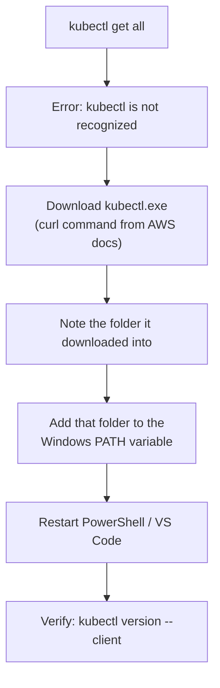
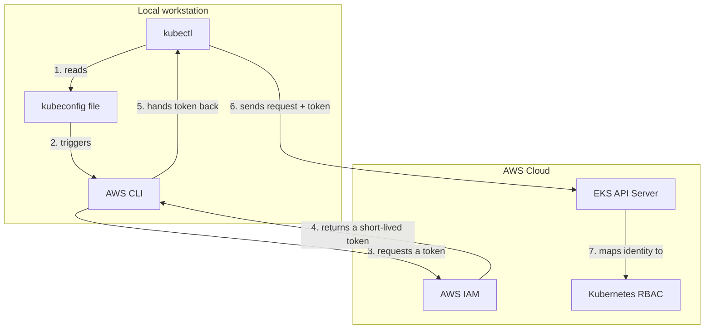

# 5. Installing kubectl (Windows)
*Section 2: EKS Basics · ~8 min*

## Getting kubectl.exe onto your machine

`kubectl` works identically on every Kubernetes cluster, but it still has to be installed locally first. On Windows, it ships as a single standalone file — `kubectl.exe` — with no installer wizard needed. AWS provides its own **Amazon-vended** build of `kubectl.exe`, tested specifically for compatibility with EKS.

If you run `kubectl get all` on a fresh machine, Windows will tell you the command isn't recognized. Here's the fix:



1. **Download the binary.** Use the `curl` command from the official AWS EKS docs (run it in PowerShell). It downloads `kubectl.exe` to your current folder — often `C:\Users\<you>`.
2. **Add its folder to PATH.** Downloading isn't enough — Windows only finds executables that live in a folder listed in the `Path` environment variable. Search Start Menu for **"Environment Variables"** → **Edit the system environment variables** → **Environment Variables** → select **Path** under User variables → **Edit** → **New** → paste the *folder path* (not the file path, e.g. `C:\Tools\K8s\`, not `C:\Tools\K8s\kubectl.exe`).
3. **Restart your terminal.** PATH changes only take effect in *new* terminal sessions — close and reopen PowerShell or VS Code completely.
4. **Verify:**

```powershell
kubectl version --client
```

> **Pro tip:** if you'd rather skip the manual steps, a package manager like `winget` or Chocolatey can install `kubectl` and wire up PATH in one shot: `winget install Kubernetes.kubectl`.

### Common mistakes

- **Forgetting to restart the terminal** — an already-open window never picks up a PATH change.
- **Pasting the file path instead of the folder path** into the PATH variable.

## How kubectl actually authenticates against EKS

`kubectl` is a pure, open-source tool — it has no built-in concept of AWS IAM. So how does `kubectl get pods` against an EKS cluster actually get authorized? Through a local handoff between `kubectl`, the AWS CLI, and your `kubeconfig` file.



- **The `kubeconfig` file** (`~/.kube/config`) is the bridge. Running `aws eks update-kubeconfig` writes the cluster's API endpoint, certificate, and an `exec` block into it.
- **The `exec` block** tells `kubectl` to pause and call the AWS CLI whenever it needs to authenticate — specifically `aws eks get-token`, which uses your local IAM credentials to mint a short-lived (15-minute) token:

```yaml
users:
- name: arn:aws:eks:us-east-1:1234567890:cluster/dev-cluster
  user:
    exec:
      apiVersion: client.authentication.k8s.io/v1beta1
      command: aws
      args:
      - --region
      - us-east-1
      - eks
      - get-token
      - --cluster-name
      - dev-cluster
```

- **`kubectl`** injects that token into an HTTPS authorization header and sends the request to the EKS API server.

## Authentication vs. authorization — two separate gates

This distinction trips people up constantly, and it's a favorite interview question:

- **Authentication ("who are you?")** — handled by **AWS IAM**. The token proves your IAM identity.
- **Authorization ("what are you allowed to do?")** — handled by **Kubernetes RBAC**, completely separately. Even a fully valid IAM identity (say, an AWS account Administrator) gets rejected by the API server if Kubernetes RBAC hasn't granted that identity any permissions.

The one exception: the IAM identity that **originally created** the EKS cluster is automatically granted permanent, hidden `system:masters` (super-admin) access in that cluster's RBAC.

## Key takeaways
- `kubectl.exe` on Windows needs its folder added to the system **PATH**, and a terminal restart, before it's recognized.
- `kubectl` never sees your AWS keys directly — it delegates to the AWS CLI via the `exec` block in your `kubeconfig` to get a short-lived token.
- **IAM authenticates you; Kubernetes RBAC authorizes you** — these are two independent checks, and passing one doesn't guarantee passing the other.
- The one built-in exception: whoever's IAM identity created the cluster gets automatic super-admin (`system:masters`) RBAC access.

## FAQ

**Q: I added kubectl's folder to PATH and clicked OK, but my open terminal still says "not recognized." Why?**
A: PATH changes only apply to new terminal sessions. Close the terminal completely (or restart VS Code) and open a fresh one.

**Q: Does `kubectl` store my AWS credentials anywhere?**
A: No. It delegates entirely to the AWS CLI, which manages your IAM keys and only ever hands `kubectl` a short-lived (15-minute) token.

**Q: I have full AWS Administrator access, but `kubectl get pods` still returns `Forbidden` — what's missing?**
A: You've authenticated successfully via IAM, but Kubernetes RBAC hasn't granted your identity any permissions inside the cluster. A cluster admin needs to map your IAM user/role to a Kubernetes RBAC Role via the `aws-auth` ConfigMap (or the EKS Access Entries API).

**Previous:** [← 4. AWS CLI Installation & Configuration](04_AWS_CLI_Installation_and_Configuration.md)
**Next:** [6. Installing eksctl →](06_Eksctl_Install.md)
