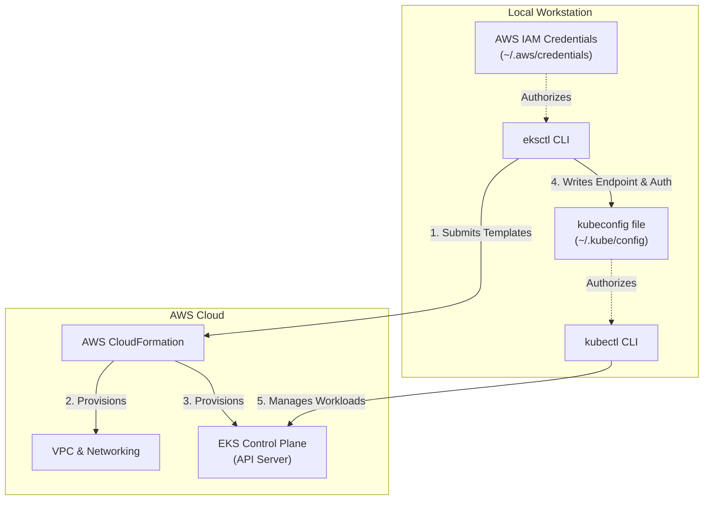
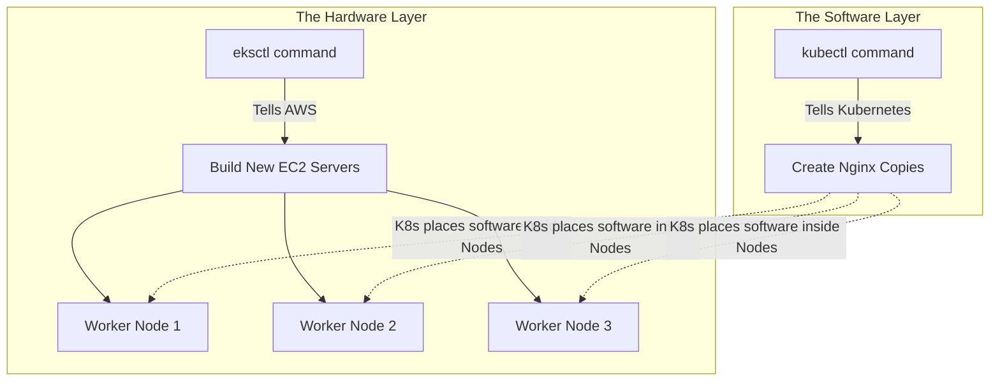

# Chapter Title: Installing and Understanding eksctl

## Overview

`eksctl` is the official command-line tool for Amazon EKS, designed to abstract away the complex manual provisioning of AWS infrastructure. While `kubectl` manages the applications running *inside* your cluster, `eksctl` is responsible for building the cluster itself. This chapter covers the installation process for Windows using the Chocolatey package manager and dives deep into how `eksctl` operates under the hood.

## Why This Matters

Building a Kubernetes cluster from scratch on AWS requires manually configuring VPCs, subnets, routing tables, IAM roles, and worker node AMIs. `eksctl` reduces this days-long process into a single command by automatically generating and executing AWS CloudFormation templates. Understanding how it relies on your local AWS credentials and interacts with `kubectl` is crucial for seamless cluster lifecycle management.

## Key Concepts

* **Chocolatey (`choco`):** A command-line package manager for Windows (similar to `apt` on Ubuntu or `brew` on macOS) used to cleanly install `eksctl` and other DevOps tools.
* **Execution Policy:** A Windows security feature that dictates whether PowerShell scripts can run. This must be bypassed or modified to install Chocolatey.
* **CloudFormation Engine:** The underlying AWS service `eksctl` uses to provision infrastructure.
* **The Handoff:** The process where `eksctl` finishes building the AWS infrastructure and automatically configures `kubectl` to take over cluster management.

## Detailed Notes: Installation (Windows Focus)

**Prerequisites**
Before installing `eksctl`, you must have the AWS CLI installed and configured with IAM credentials, as well as `kubectl` installed.

**The Windows Installation Process**

1. **Administrative Shell:** You cannot install Chocolatey or `eksctl` using standard user privileges. You must open your terminal (e.g., PowerShell or VS Code) as an Administrator.
2. **Execution Policy:** By default, Windows PowerShell restricts scripts from running. You must check the policy by running `Get-ExecutionPolicy`. If it returns `Restricted`, you must change it by running `Set-ExecutionPolicy AllSigned`.
3. **Install Chocolatey:** Run the official web-based installation script provided by the Chocolatey documentation.
4. **Install eksctl:** Once `choco` is installed, simply run `choco install eksctl`.

## eksctl vs. kubectl: What to Use When

| Feature | `eksctl` | `kubectl` |
| --- | --- | --- |
| **Primary Domain** | AWS Infrastructure (Hardware/Networking) | Kubernetes Resources (Software/Workloads) |
| **Typical Actions** | Create clusters, add Node Groups, configure VPCs, create IAM service accounts. | Create Pods, Deployments, Services, read application logs. |
| **Target Audience** | Cloud/AWS provider API | Kubernetes API Server |
| **Scope** | EKS only (Amazon specific) | Universal (Works on any K8s cluster) |

## Under the Hood: How it Works and Communicates

**What eksctl Needs to Communicate**
`eksctl` does not have its own login mechanism. It completely relies on the AWS CLI credentials stored locally on your machine (`~/.aws/credentials`). When you execute an `eksctl` command, it assumes the identity of your configured IAM user to authorize its actions against the AWS API.

**How the Tools Work Together (The Handoff)**

1. **Generation:** You run `eksctl create cluster`.
2. **Translation:** `eksctl` translates your command into a massive, complex AWS CloudFormation template.
3. **Execution:** It submits this template to AWS, which provisions the VPC, EC2 instances, and the EKS Control Plane.
4. **The Kubeconfig Update (The Integration):** Once the cluster is fully active, `eksctl` pulls the new cluster's API endpoint and certificate. It automatically edits your local `~/.kube/config` file, writing the exact `exec` block required for authentication.
5. **The Handoff:** Because `eksctl` updated the `kubeconfig` file, `kubectl` is immediately authorized and ready to manage the new cluster without any manual configuration on your part.

## Architecture & Integration Diagram

## Commands and Examples

| Command | Description |
| --- | --- |
| `Get-ExecutionPolicy` | Windows PowerShell command to check script execution restrictions. |
| `Set-ExecutionPolicy AllSigned` | Relaxes Windows restrictions so the Chocolatey installation script can run. |
| `choco install eksctl` | Installs the `eksctl` binary globally on a Windows machine. |
| `eksctl version` | Verifies successful installation. |

## FAQ: eksctl Integration & Operations

**Q: Do I use `eksctl` to deploy my web application onto the cluster?**
**A:** No. `eksctl` is strictly for managing the "metal" (the AWS EC2 nodes, VPCs, and cluster control plane). Once the cluster exists, you switch entirely to `kubectl` to deploy your actual software applications (Pods, Deployments).

**Q: If `eksctl` creates the cluster, how does `kubectl` magically know how to connect to it?**
**A:** There is no magic—it is an automated handoff. The very last step of the `eksctl create cluster` process is to download the newly created cluster's credentials and forcefully update your local `~/.kube/config` file. Since `kubectl` reads this file by default, it instantly gains access to the new environment.

**Q: How does `eksctl` authenticate with AWS?**
**A:** It uses the exact same IAM credentials that you configured using the `aws configure` command. It reads your `~/.aws/credentials` file to sign its API requests to AWS CloudFormation.

## Practice Exercises

**1. Tool Selection Scenario**
**Question:** You need to increase the number of physical worker nodes from 2 to 5, and then you need to increase the number of Nginx web server replicas from 2 to 5. Which CLI tools do you use for each step?
**Answer:**

* **Step 1:** Use `eksctl` to scale the AWS Node Group (the physical/virtual servers).
* **Step 2:** Use `kubectl` to scale the Nginx Deployment (the Kubernetes application workloads).

**`eksctl`** controls the **hardware** (the physical/virtual servers). **`kubectl`** controls the **software** (your application code) running *inside* that hardware.

**The Box Analogy**

* **`eksctl` gives you empty boxes:** When you scale from 2 to 5 Worker Nodes, AWS boots up 3 brand new, empty computers. They are running, consuming electricity, and costing you money, but they aren't doing any actual work yet.
* **`kubectl` fills the boxes:** When you scale from 2 to 5 Nginx Replicas, Kubernetes creates 3 new running copies of your application code. Kubernetes then looks at your empty computers (Nodes) and places the Nginx code inside them so they actually start serving web traffic.

**Why you cannot just use one:**
If you tell `kubectl` to create 100 copies of Nginx, but you only have 2 physical Nodes, your two computers will run out of memory. The extra 98 Nginx copies will crash or get stuck in a "Pending" state because there is literally no physical RAM left to hold them. You *must* use `eksctl` first to buy more computers, so `kubectl` has a place to put your software.

**2. Troubleshooting Windows Installation**
**Question:** You paste the Chocolatey installation script into PowerShell, but you receive a red error stating "running scripts is disabled on this system." Provide the exact step-by-step commands to resolve this and verify the fix.
**Answer:**

* **Step 1:** Ensure your PowerShell terminal is running as Administrator.
* **Step 2:** Run `Get-ExecutionPolicy` to confirm it currently says `Restricted`.
* **Step 3:** Run `Set-ExecutionPolicy AllSigned` and accept the prompt.
* **Step 4:** Re-run the Chocolatey installation script.
