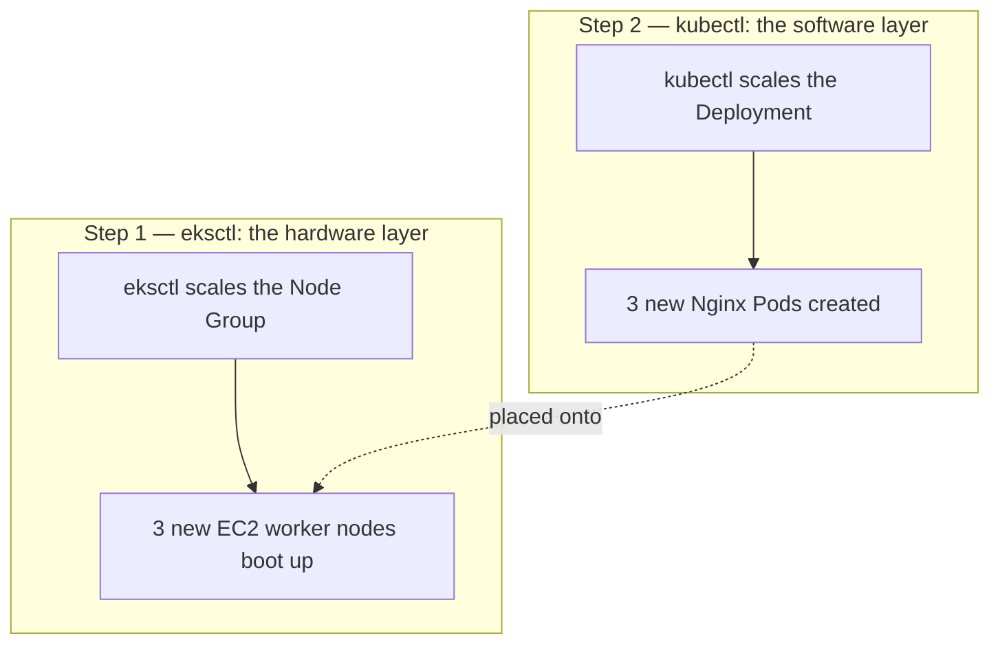
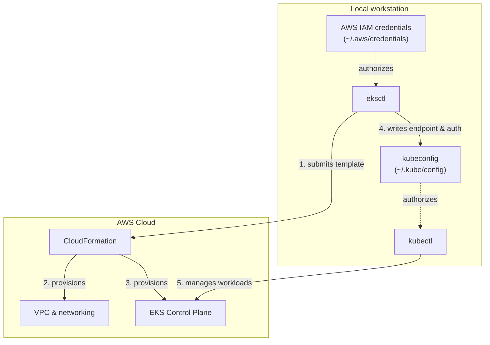

# 6. Installing eksctl (Windows)
*Section 2: EKS Basics · ~8 min*

## Installing eksctl via Chocolatey

On Windows, the cleanest way to install `eksctl` is through **Chocolatey** (`choco`) — a package manager for Windows, playing the same role `apt` plays on Ubuntu or `brew` plays on macOS.

**Before you start**, make sure you already have the AWS CLI installed and configured (see [lecture 4](04_AWS_CLI_Installation_and_Configuration.md)) and `kubectl` installed (see [lecture 5](05_kubectl_Installation_Windows.md)).

1. **Open an Administrator shell.** Installing Chocolatey or `eksctl` requires admin privileges — open PowerShell (or VS Code) "as Administrator."
2. **Check your script execution policy:**
   ```powershell
   Get-ExecutionPolicy
   ```
   If it returns `Restricted`, PowerShell is blocking scripts from running. Allow it with:
   ```powershell
   Set-ExecutionPolicy AllSigned
   ```
3. **Install Chocolatey** using the official install script from the Chocolatey docs.
4. **Install eksctl:**
   ```powershell
   choco install eksctl
   ```
5. **Verify:**
   ```powershell
   eksctl version
   ```

### Common mistake

If pasting the Chocolatey install script gives you a red error like *"running scripts is disabled on this system,"* it means you skipped step 1 or 2 — reopen PowerShell as Administrator, confirm `Get-ExecutionPolicy` reports something other than `Restricted` (fixing it with `Set-ExecutionPolicy AllSigned` if needed), then re-run the install script.

## eksctl vs. kubectl, one more time

| | `eksctl` | `kubectl` |
| --- | --- | --- |
| **Domain** | AWS infrastructure (hardware/networking) | Kubernetes resources (software/workloads) |
| **Typical actions** | Create clusters, add node groups, configure VPCs | Create Pods, Deployments, Services; read logs |
| **Talks to** | The AWS API | The Kubernetes API server |
| **Scope** | EKS only | Any Kubernetes cluster, anywhere |

**The "empty boxes" mental model:** scaling worker nodes from 2 to 5 with `eksctl` just boots 3 new, empty computers — they cost money and sit idle, doing no work. Scaling your Nginx Deployment from 2 to 5 with `kubectl` creates 3 new copies of your app and places them onto whatever Nodes have room. **You need both**: if you ask `kubectl` for 100 Nginx replicas but only have 2 physical Nodes, the extra 98 will sit stuck in `Pending` — there's simply no RAM left to place them. `eksctl` buys the computers; `kubectl` puts software inside them.



## How eksctl authenticates, and how it hands off to kubectl

`eksctl` has no login of its own — it reuses whatever AWS CLI credentials are already configured locally (`~/.aws/credentials`), acting as your configured IAM user for every API call it makes.

**What happens when you run `eksctl create cluster`:**

1. `eksctl` translates your command into a full AWS CloudFormation template.
2. It submits that template, which provisions the VPC, EC2 instances, and the EKS Control Plane.
3. Once the cluster is active, `eksctl` automatically writes the new cluster's endpoint, certificate, and `exec` auth block into your local `~/.kube/config` file (the same file described in [lecture 5](05_kubectl_Installation_Windows.md)).
4. Because that file is now updated, **`kubectl` is immediately ready to manage the new cluster** — no manual configuration needed.



## Key takeaways
- Install `eksctl` on Windows via Chocolatey; it needs an Administrator shell and (usually) a relaxed PowerShell execution policy.
- `eksctl` handles **infrastructure** (the hardware layer); `kubectl` handles **applications** (the software layer) — you need both, for different jobs.
- `eksctl` authenticates using your existing AWS CLI credentials — no separate login.
- After `eksctl create cluster` finishes, it automatically updates your `kubeconfig`, so `kubectl` works against the new cluster immediately.

## FAQ

**Q: Do I use `eksctl` to deploy my application?**
A: No. `eksctl` only manages the AWS "metal" — EC2 nodes, VPCs, the control plane. Once the cluster exists, all application deployment goes through `kubectl`.

**Q: How does `kubectl` "magically" know how to connect right after `eksctl` finishes?**
A: No magic — the last step of `eksctl create cluster` downloads the new cluster's credentials and writes them into your local `~/.kube/config`. Since `kubectl` reads that file by default, it has access instantly.

**Q: I need to go from 2 worker nodes to 5, and from 2 app replicas to 5 — which tool do I use for each?**
A: `eksctl` to scale the Node Group (the physical/virtual servers); `kubectl` to scale the Deployment (the application Pods running on those servers).

**Previous:** [← 5. Installing kubectl on Windows](05_kubectl_Installation_Windows.md)
**Next:** [7. Creating Your First EKS Cluster →](07_CreateFirstCluster.md)
