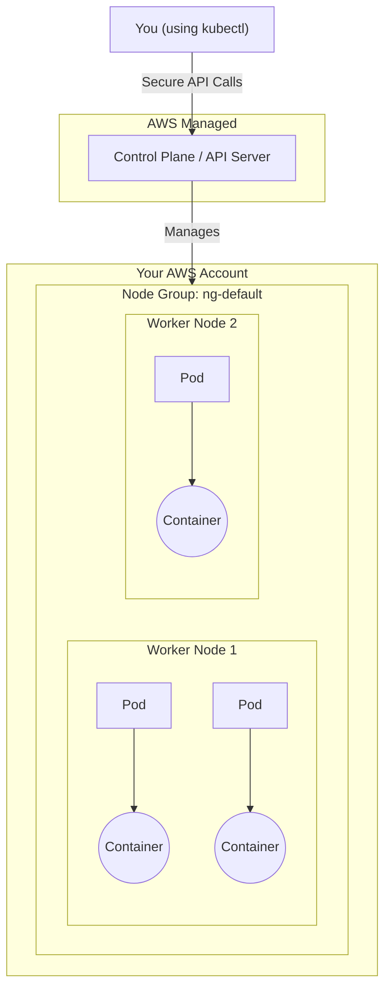

# 7. Creating Your First EKS Cluster

*Section 2: EKS Basics · ~15 min*

## The Big Picture: EKS Architecture

Before we run any commands, it helps to understand what an Amazon EKS (Elastic Kubernetes Service) cluster actually is. Every EKS cluster is split into two completely separate worlds: **The Control Plane** (managed by AWS) and the **Worker Nodes** (managed by you).

To understand how the pieces fit together, think of Kubernetes like a real estate development. The pieces fit inside each other like Russian nesting dolls, from largest to smallest:

1. **The Control Plane (City Hall):** The brain of the operation. It doesn't hold any of your actual applications (no Pods or Containers). Its only job is to manage the city—scheduling new applications, monitoring health, and keeping the database (`etcd`) of what should be running. In EKS, AWS builds and maintains City Hall for you on their own hidden servers. You cannot log into it; you just send it instructions, and you pay a flat hourly fee for AWS to keep it running.
2. **Node Group (A row of identical apartment buildings):** A Node Group isn't a physical thing itself; it is a fleet of identically configured virtual machines. If traffic spikes, AWS will automatically build more identical "buildings" in this group.
3. **Worker Node (One apartment building):** The actual physical or virtual computer (in AWS, an EC2 instance). This provides the CPU, memory, and hard drive space to run your apps.
4. **Pod (A single apartment inside the building):** A wrapper that lives *inside* the Worker Node. A single Worker Node can hold dozens or hundreds of Pods.
5. **Container (A person living in the apartment):** Your actual running application code (like a Docker container), living *inside* the Pod. Most of the time, a Pod holds just one Container. Sometimes, a Pod holds multiple Containers that need to share the same local network and storage.

Here is how the architecture looks from a bird's-eye view:



### How Does `kubectl` Securely Talk to the Control Plane?

Since the Control Plane is hidden away on AWS's private servers, how does your local `kubectl` command securely communicate with it? It uses **AWS IAM (Identity and Access Management)** combined with a process called the **AWS IAM Authenticator**.

When you type a command, `kubectl` looks at your hidden `~/.kube/config` file, which tells it to run an AWS CLI command behind the scenes. This generates a short-lived, cryptographically signed token using your AWS credentials. `kubectl` sends this token to the EKS Control Plane, which verifies your identity with AWS STS (Security Token Service). If verified, Kubernetes checks its internal permissions (RBAC) to ensure you are allowed to perform the action.

---

## Moment of Truth: Spinning Up a Real Cluster

Everything so far has been theory and tooling. Time to actually create an EKS cluster with `eksctl`.

```bash
eksctl create cluster \
  --name eksctl-test \
  --nodegroup-name ng-default \
  --node-type t3.micro \
  --nodes 2

```

* `--name` — the cluster's name (`eksctl-test`).
* `--nodegroup-name` — the name of the worker-node group it creates. This is **optional**; you can create a cluster with no node group at all if you want (a Control-Plane-only cluster).
* `--node-type` / `--nodes` — **always set these explicitly.** As covered in [lecture 2](https://www.google.com/search?q=02_eksctl.md), the default worker type is a non-free-tier `m5.large`. `t3.micro` keeps you on the Free Tier.

Copy that command into a terminal that has both the AWS CLI and `eksctl` installed, hit enter, and wait. This genuinely takes **5–10 minutes**, because `eksctl` is doing a lot under the hood — VPCs, subnets, security groups, and more.

> **Note on the `--version` flag:** the original recording pins this to Kubernetes 1.16, which is long past EKS's supported version window by now. In practice, either omit `--version` to get EKS's current default, or check the [AWS docs for currently supported EKS versions](https://docs.aws.amazon.com/eks/latest/userguide/kubernetes-versions.html) before picking one.

---

## What's Actually Happening Behind the Scenes

`eksctl` doesn't talk to EKS directly — it submits **CloudFormation** stacks, exactly as described in [lecture 2](https://www.google.com/search?q=02_eksctl.md). For one `eksctl create cluster` call, you get (at least) two stacks:

* `eksctl-eksctl-test-cluster` — the EKS cluster itself (VPC, subnets, Control Plane).
* `eksctl-eksctl-test-nodegroup-ng-default` — the worker node group (Auto Scaling Group, EC2 nodes).

Open the **AWS CloudFormation console** and you'll see both stacks. Under **Resources**, you'll find everything `eksctl` provisioned for you — security group ingress/egress rules, an Auto Scaling Group, an instance profile, and more. Under **Outputs**, you'll find things like the worker node's instance role and instance profile ARNs.

Open the **EKS console** and you'll see your cluster listed by name (`eksctl-test`), along with its Kubernetes version and other details.

---

## Verifying with kubectl

```bash
kubectl get all

```

Since you haven't deployed anything yet, this should return almost nothing — just the cluster's default `kubernetes` Service (a `ClusterIP` Service that exists in every namespace by default). If you see that, your cluster is live and `kubectl` is already talking to it.

### Wait — how does kubectl know *which* cluster to use?

Notice the `kubectl` command above never mentioned a cluster name. That's because `eksctl` already updated your local **kubeconfig** (`~/.kube/config`) for you when the cluster finished creating — the same file described in [lecture 5](https://www.google.com/search?q=05_kubectl_Installation_Windows.md). `kubectl` simply uses whichever cluster is the *current context* in that file.

If you have multiple clusters and need to switch between them, that's a slightly more advanced topic — a later lecture in this course covers kubeconfig contexts in depth. For now, just know: one cluster created, kubeconfig auto-updated, `kubectl` just works.

---

## The Other Way: Using a Config File

Typing every flag on the command line works, but it doesn't scale well once you have several node groups, or want the setup checked into version control. `eksctl` also accepts a YAML **config file** instead.

### Adding node groups to an existing cluster

Say you want to add two more node groups to your `eksctl-test` cluster — a regular ("unmanaged") node group and a Managed Node Group (the difference between the two gets its own lecture later — don't worry about it yet):

```yaml
# eksctl-nodegroup.yaml
apiVersion: eksctl.io/v1alpha5
kind: ClusterConfig

metadata:
  name: eksctl-test
  region: us-west-2

nodeGroups:
  - name: ng-1-public
    instanceType: t3.micro
    desiredCapacity: 2

managedNodeGroups:
  - name: ng-2-managed
    instanceType: t3.micro
    desiredCapacity: 2

```

```bash
eksctl create nodegroup --config-file=eksctl-nodegroup.yaml

```

This targets the existing `eksctl-test` cluster in `us-west-2` and creates both node groups — each one backed by its own CloudFormation stack, same as before. Confirm it worked:

```bash
eksctl get nodegroup --cluster eksctl-test

```

You should now see **three** node groups: the original `ng-default` (from cluster creation), plus `ng-1-public` and `ng-2-managed`.

### Creating the whole cluster from a config file

The same idea works for cluster creation itself — instead of a long list of flags, point `eksctl` at a file:

```yaml
# eksctl-create-cluster.yaml
apiVersion: eksctl.io/v1alpha5
kind: ClusterConfig

metadata:
  name: eksctl-test
  region: us-west-2

nodeGroups:
  - name: ng-default
    instanceType: t3.micro
    desiredCapacity: 2

```

```bash
eksctl create cluster --config-file=eksctl-create-cluster.yaml

```

This creates the exact same cluster as the very first command in this lecture — one node group, `ng-default`, with 2 `t3.micro` nodes. As mentioned in [lecture 2](https://www.google.com/search?q=02_eksctl.md), this config-file approach is the industry-standard way to manage `eksctl` clusters, since it's version-controllable like any other infrastructure-as-code.

---

## Cleaning Up: Delete the Cluster

```bash
# List every cluster currently running, to double-check what you're about to delete
eksctl get cluster

# Delete it
eksctl delete cluster --name eksctl-test

```

Exactly like creation, deletion works by tearing down the underlying CloudFormation stacks — the cluster, its node groups, and everything they provisioned. Confirm it's gone:

```bash
eksctl get cluster
# -> No clusters found

```

---

## Key Takeaways

* **The Architecture:** Clusters consist of an AWS-managed Control Plane (City Hall) and user-managed Worker Nodes (apartment buildings) organized into Node Groups. Pods live inside Worker Nodes, and Containers live inside Pods.
* **Creation:** `eksctl create cluster --name <name> --node-type t3.micro --nodes <n>` spins up a real EKS cluster in about 5–10 minutes; always set `--node-type` to stay Free Tier eligible.
* **CloudFormation:** Behind the scenes, `eksctl` submits one CloudFormation stack per cluster and one per node group — visible in the CloudFormation console.
* **Connectivity:** `kubectl` communicates securely with the Control Plane using AWS IAM. `eksctl` automatically updates your local **kubeconfig**, so `kubectl` works against the new cluster immediately.
* **Config Files:** A YAML config file (`--config-file=...`) is the version-control-friendly alternative to typing every flag by hand, for both `eksctl create cluster` and `eksctl create nodegroup`.
* **Cleanup:** Always run `eksctl delete cluster --name <name>` when you're done — an idle cluster still costs money.

---

## FAQ

**Q: I never told `kubectl` which cluster to talk to — why does `kubectl get all` just work?**
A: `eksctl` writes the new cluster's connection details into your local `~/.kube/config` (kubeconfig) automatically as the last step of cluster creation, and sets it as the active context. `kubectl` always uses whatever the active context is.

**Q: What does `kubectl get all` show on a totally fresh cluster?**
A: Essentially nothing — just the built-in `kubernetes` Service that every namespace has by default. That's actually a good sign: it means your cluster and `kubectl` connection are both working, and you simply haven't deployed anything yet.

**Q: Do I have to give my node group a name?**
A: No — `--nodegroup-name` (and having a node group at all) is optional when creating a cluster. You can create a control-plane-only cluster and add node groups later.

**Q: What's the actual difference between `eksctl create cluster` with flags vs. with `--config-file`?**
A: They do the same thing — the config file is just a reusable, version-controllable way to express the same parameters, instead of retyping a long command every time.

**Previous:** [← 6. Installing eksctl](https://www.google.com/search?q=06_Eksctl_Install.md)
**Next:** [8. The Hidden Pod Limit Per Node →](https://www.google.com/search?q=08_PodLimitOnCluster.md)
