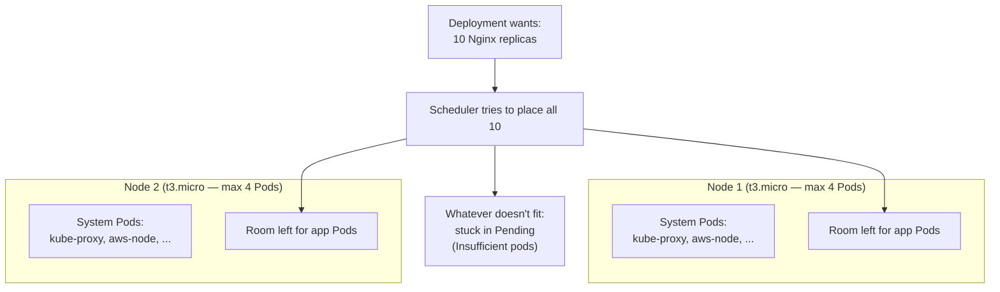

# 8. The Hidden Pod Limit Per Node
*Section 2: EKS Basics · ~6 min*

## The symptom you'll almost certainly hit

Spin up a cluster with small worker nodes (say, `t3.micro`), deploy a handful of Pods, and at some point you'll try to scale up and see Pods just... sit there. Not crashing — **stuck in `Pending` forever.**

This isn't a bug. Every EC2 instance type has a **hard maximum number of Pods it can ever run**, no matter how much idle CPU or memory it has left.

## Why: it's about network interfaces, not CPU/RAM

On EKS, the limit comes from networking, not compute. The **Amazon VPC CNI plugin** gives every Pod its own real IP address from the VPC, by attaching Elastic Network Interfaces (ENIs) to each node and drawing Pod IPs from them. So the max-Pods number is really: *how many IP addresses can this instance type's ENIs hand out?*

Bigger instance type → more ENIs and more IPs per ENI → more Pods it can host. Smaller instance type → far fewer. A `t3.micro`, for example, tops out at just **4 Pods total** — and that includes Kubernetes' own system Pods, not just yours.

| Instance type | Max Pods (approx.) |
| --- | --- |
| `t3.micro` | 4 |
| `t3.small` | 11 |
| `t3.medium` | 17 |
| `t3.large` | 35 |
| `m5.large` | 29 |
| `m5.xlarge` | 58 |

> These numbers come from AWS's own `eni-max-pods` reference and can change as AWS updates instance networking — always check the [official EKS max-Pods reference](https://github.com/awslabs/amazon-eks-ami/blob/main/templates/al2/runtime/eni-max-pods.txt) for the exact number for your instance type before relying on it.

## Seeing it happen

Spin up a cluster with two `t3.micro` nodes:

```bash
eksctl create cluster --name pod-limit-test --node-type t3.micro --nodes 2
```

Even before you deploy anything, the cluster already has **system Pods** running and quietly using up part of that budget:

```bash
kubectl get ns
# default, kube-system, kube-public, kube-node-lease

kubectl get pods -n kube-system
# kube-proxy and the VPC CNI's aws-node run on every node as DaemonSets,
# plus CoreDNS — all counted against the same per-node Pod limit as your app Pods.
```

Now deploy a simple Nginx Deployment with 1 replica — no problem:

```bash
kubectl apply -f nginx-deployment.yaml
kubectl get all
# 1 Pod, Running
```

Now bump `replicas: 1` to `replicas: 10` in the YAML and re-apply (the [declarative way](../01-kubernetes-basics/14_Declarative_vs._Imperative.md) to make the change):

```bash
kubectl apply -f nginx-deployment.yaml
kubectl get pods
```

Out of 10 requested Pods, only a couple come up `Running` — the rest sit in `Pending`. Between the two `t3.micro` nodes (4 Pods each, max) and the system Pods already occupying some of that space, there simply isn't room left for all 10 Nginx replicas.


Check why with `describe`:

```bash
kubectl describe pod <pending-pod-name>
```

```
Events:
  Warning  FailedScheduling  ...  0/2 nodes are available: 2 Insufficient pods.
```

That message is the whole story: both nodes are full on their **Pod count**, not their CPU or memory. There's nowhere left to schedule this Pod.



Run the exact same 10-replica Deployment on `m5.large` nodes instead, and all 10 schedule without any issue — plenty of headroom in the Pod budget.

## What this means for you

- **Learning/personal projects:** `t3.micro` is fine and Free Tier friendly, but expect to hit this ceiling fast with even a small number of Pods.
- **Real projects:** you're very unlikely to be running production workloads on `t3.micro` nodes — bigger instance types give you far more Pod headroom.
- If you do need to use a bigger instance type (like `m5.large`) just to follow along with a demo, **delete the cluster the moment you're done** — see [lecture 7](07_CreateFirstCluster.md) for the `eksctl delete cluster` command. Don't leave larger, non-Free-Tier nodes running idle.

## Key takeaways
- Every EC2 instance type has a **hard maximum Pod count**, driven by how many ENIs/IPs it can offer — not by CPU or memory.
- **System Pods count against that same limit** — `kube-proxy`, the VPC CNI's `aws-node`, CoreDNS, etc. are already eating into your budget before you deploy anything.
- `t3.micro` caps out around **4 Pods total** per node — great for learning, easy to hit the ceiling with.
- A Pod stuck in `Pending` with a `FailedScheduling` / `Insufficient pods` event means the node is full on **Pod count**, not resources — the fix is a bigger instance type (or more nodes), not more CPU/memory requests.

## FAQ

**Q: My Pod is `Pending` and `describe` says "Insufficient pods" — but `kubectl top nodes` shows plenty of free CPU and memory. What's going on?**
A: The Pod limit is separate from resource limits. Each node can only hand out as many Pod IPs as its ENIs support, regardless of how much CPU/RAM is actually free. Move to a larger instance type (or add more nodes) to raise the ceiling.

**Q: Do my own Deployments have to share the Pod budget with Kubernetes' own system Pods?**
A: Yes — `kube-proxy`, the VPC CNI (`aws-node`), CoreDNS, and any other Pods in `kube-system` all count toward the same per-node maximum as your application Pods.

**Q: Is there any way to raise the Pod limit without switching to a bigger instance type?**
A: Yes — the VPC CNI supports an advanced mode called **prefix delegation**, which assigns whole address prefixes to each ENI instead of individual IPs, significantly raising the max-Pods ceiling on the same instance type. It's beyond this lecture's scope, but worth knowing it exists if you ever need to push small instances further.

**Previous:** [← 7. Creating Your First EKS Cluster](07_CreateFirstCluster.md)
